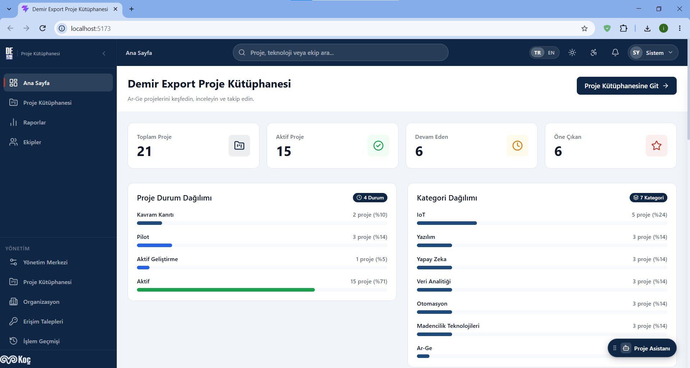
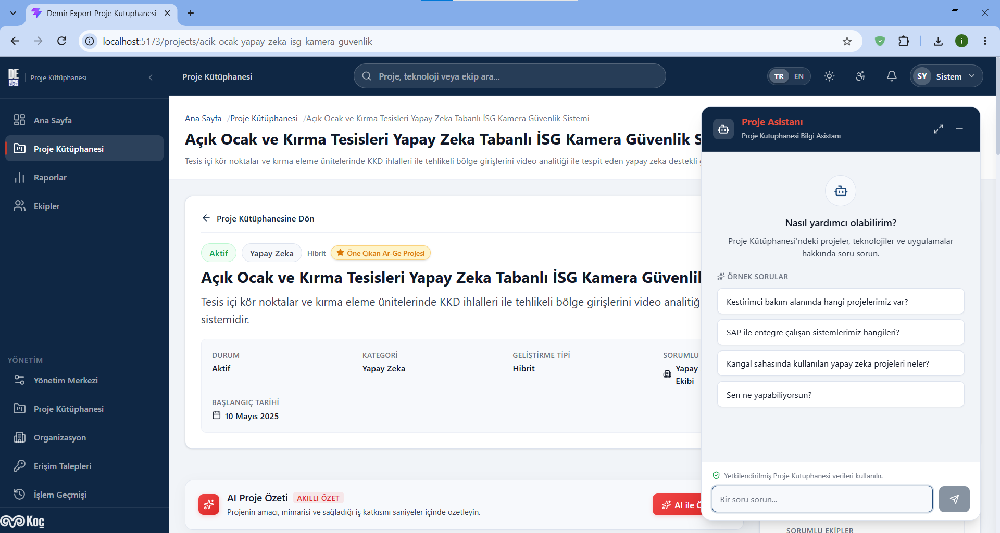
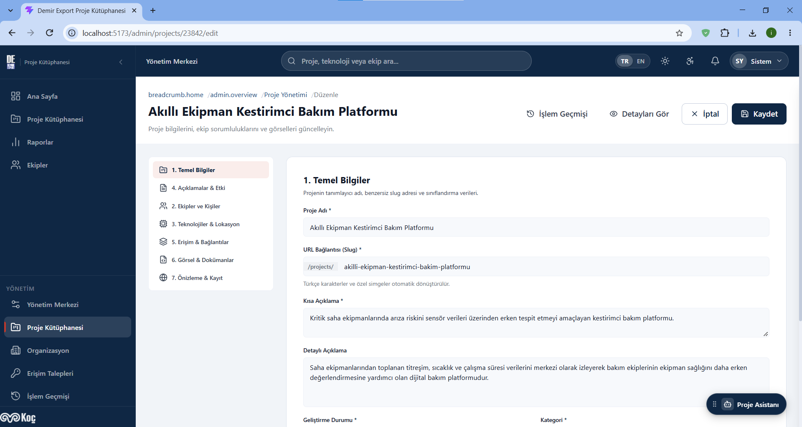

# 🌟 ProjectAtlas — Kurumsal Ar-Ge Proje Kütüphanesi & AI Bilgi Havuzu

[](https://dotnet.microsoft.com/)
[](https://react.dev/)
[](https://www.typescriptlang.org/)
[](https://learn.microsoft.com/ef/core/)
[](https://www.microsoft.com/sql-server)
[](https://huggingface.co/BAAI/bge-m3)

> 📌 **Staj Projesi Bilgilendirmesi:**  
> Bu proje, **Demir Export A.Ş. (Koç Holding)** bünyesindeki Yazılım Mühendisliği staj programı kapsamında geliştirilmiştir.  
> Bu portföy sürümünde kullanılan tüm projeler, organizasyonel birimler, metrikler ve dokümanlar **%100 sentetik (mock/fictional)** verilerden oluşmaktadır. Şirket içi canlı sistemlere, gizli kurumsal verilere veya dış kimlik sağlayıcılarına erişim içermez.

---

## 📸 Ekran Görüntüleri & Görsel Vitrin

> 💡 *Aşağıdaki ekran görüntüleri projenin gerçek çalışma anındaki arayüz bileşenlerini yansıtmaktadır.*

<div align="center">

### 1. Ana Sayfa & Proje KeÅŸif Vitrini

*Modern kart tasarımları, gelişmiş filtreleme, arama ve istatistik özet çubukları.*

---

### 2. Proje Detayı & Yerel Yapay Zeka (RAG) Asistanı

*Kapsamlı teknik/yönetsel proje detayları, entegrasyon şemaları ve yerel Qwen/BGE-M3 destekli akıllı asistan widget'ı.*

---

### 3. Zengin Proje Editörü & Doküman Yönetimi

*Çok adımlı form validasyonları, kapak görseli seçici, ekip üyesi bağlama ve güvenli doküman yükleme paneli.*

---

### 4. Modül Erişim Yönetimi & Talep İş Akışı

*Raporlar ve Ekipler modüllerine özel talep oluşturma, onaylama, reddetme ve yetki kaldırma (revocation) paneli.*

---

### 5. Yönetici Paneli & Denetim Günlükleri (Audit Logs)

*Sistem genelindeki tüm veri mutasyonlarını, onay süreçlerini ve kullanıcı hareketlerini kaydeden denetim mekanizması.*

---

### 6. Ä°nteraktif Raporlama & Analitik Grafikler

*Departman dağılımları, teknoloji trendleri, bütçe/durum analizleri ve SVG/Canvas veri görselleştirmeleri.*

</div>

---

## 🎯 Proje Vizyonu ve Amacı

Büyük ölçekli endüstriyel kuruluşlarda (Madencilik, IoT, Ağır Sanayi, Otomasyon) geliştirilen yazılım, yapay zeka, saha teknolojisi ve Ar-Ge projeleri çoğunlukla departman silolarında sıkışıp kalmaktadır.

**ProjectAtlas**, kurum genelinde geliştirilen tüm inovasyon ve dijitalleşme projelerini tek bir merkezde toplayarak:
1. **Keşfedilebilirlik:** Teknik bilgisi az olan saha operasyon personelinden üst düzey yöneticilere kadar herkesin projeleri kolayca incelemesini,
2. **Yapay Zeka Destekli Bilgi Çıkarımı (RAG):** Doğal dille projeler hakkında soru sorulabilmesini ve anlamsal (semantik) arama yapılabilmesini,
3. **Mükerrer Efor Önleme:** Başka bir sahadaki benzer ihtiyacın daha önce nasıl çözüldüğünü teknoloji ve mimari etiketleriyle görünür kılmayı,
4. **Kurumsal Yönetişim:** Proje taslağı oluşturma, yönetici onayı, modül bazlı erişim kontrolü ve denetim loglarıyla tam izlenebilirlik sunmayı sağlar.

---

## 🏛️ Mimari Tasarım & Katmanlı Yapı (Clean Architecture)

Proje, **Temiz Mimari (Clean Architecture)** ve **Domain-Driven Design (DDD)** ilkeleri gözetilerek 4 bağımsız katmanda inşa edilmiştir:

```
ProjectAtlas/
├── backend/
│   ├── src/
│   │   ├── DeUygulamaVitrini.Domain/          # Saf iş kuralları, Varlıklar, Enum'lar, Sabitler
│   │   ├── DeUygulamaVitrini.Application/     # CQRS/Use-Case servisleri, DTO'lar, Arayüzler, Excel/Import
│   │   ├── DeUygulamaVitrini.Infrastructure/  # EF Core 10, SQL Server, Local AI Provider, Güvenlik
│   │   └── DeUygulamaVitrini.API/             # REST Controller'lar, Rate Limiter, Middleware'ler
│   └── tests/
│       ├── DeUygulamaVitrini.SecurityTests/   # SEC-001 Yetki ve Güvenlik Regresyon Testleri
│       ├── DeUygulamaVitrini.AiTests/         # RAG, Embedding ve Warm-Up Testleri
│       ├── DeUygulamaVitrini.ExcelTests/      # Toplu İçe/Dışa Aktarım Doğrulama Testleri
│       └── DeUygulamaVitrini.CaptchaTests/    # Birinci Taraf SVG CAPTCHA Testleri
└── frontend/                                  # React 19 + TypeScript Single Page Application (SPA)
    ├── src/
    │   ├── components/                        # UI Tasarım Sistemi (Cards, Modals, Forms, Charts)
    │   ├── context/                           # Auth, ModuleAccess, Theme, Accessibility Context'leri
    │   ├── pages/                             # Sayfa Bileşenleri (Vitrin, Editör, Admin, Raporlar)
    │   ├── services/                          # Axios API İstemcisi & Servis Katmanı
    │   ├── styles/                            # CSS Değişkenleri, Semantic Token'lar, Light/Dark Temalar
    │   └── i18n/                              # Türkçe / İngilizce Dil Kaynakları
    └── vite.config.ts
```

---

## 🔒 Güvenlik & Yetkilendirme Mimarisi

ProjectAtlas, kurumsal güvenlik standartlarına uygun olarak tasarlanmıştır:

### 1. Kimlik Doğrulama & Oturum Yönetimi
- **ASP.NET Core Identity** altyapısı ile güvenli parola hash'leme (PBKDF2).
- **HTTP-Only, Secure, SameSite=Lax Cookie (`.DemirExport.Auth`)** oturum yönetimi.
- Frontend'e kesinlikle hassas token sızdırılmaz; tüm API istekleri `withCredentials: true` ile taşınır.
- REST API uyumlu `OnRedirectToLogin` $\rightarrow$ `401 Unauthorized` ve `OnRedirectToAccessDenied` $\rightarrow$ `403 Forbidden` JSON yanıt mimarisi.

### 2. Çok Kademeli Rol & Yetki Sistemi (RBAC)
- **SuperAdmin:** Tüm sistem konfigürasyonu, kullanıcı yönetimi, onay süreçleri ve modül atama yetkisi.
- **Admin:** Proje onaylama/reddetme, organizasyon birimlerini yönetme, raporlama ve erişim taleplerini değerlendirme.
- **Project Creator (`CanCreateProjects = true`):** Yeni proje oluşturma, kendi taslaklarını düzenleme ve onaya sunma.
- **Standard User (Viewer):** Yalnızca onaylanmış ve yayındaki projeleri görüntüleme, AI asistanını kullanma, yetkili olmadığı modüller için erişim talebi oluşturma.

### 3. Modül Seviyesinde Erişim Kontrolü & Talep İş Akışı
- **Raporlama (`reports`)** ve **Ekipler (`teams`)** modülleri hassas operasyonel veriler içerdiği için kilitlenebilir.
- Yetkisi olmayan kullanıcı girdiğinde şık bir erişim talep modalı açılır; girilen gerekçe yöneticinin onay kuyruğuna düşer.
- Yöneticiler tek tıkla onaylayabilir, gerekçeli reddedebilir veya verilen yetkiyi geçmişi koruyarak geri alabilir (`Revocation`).

### 4. Sertleştirilmiş Özel Doküman Güvenliği (SEC-001)
- Projeye eklenen teknik şartname, mimari rapor gibi özel dokümanlar **`wwwroot` dışına (`App_Data/uploads/`)** izole edilmiştir.
- Statik dosya URL'leri üzerinden anonim erişim tamamen engellenmiştir.
- Dokümanlar yalnızca yetkisi doğrulanmış kullanıcılara özel streaming endpoint'i (`GET /api/projects/{id}/documents/{docId}/download`) üzerinden güvenli başlıklarla (`X-Content-Type-Options: nosniff`, `Content-Disposition: attachment`) sunulur.
- Dizin geçişi (Path Traversal - `../../`) saldırılarına karşı mutlak dosya yolu denetimi uygulanır.

### 5. Birinci Taraf SVG CAPTCHA Savunması
- Üçüncü parti takipçi veya harici servis bağımlılığı olmayan, in-memory ve rate-limit korumalı görsel SVG CAPTCHA katmanı.
- Brute-force oturum açma girişimlerine karşı endpoint seviyesinde koruma sağlar.

---

## 🧠 Yerel Yapay Zeka & RAG (Retrieval-Augmented Generation)

ProjectAtlas, harici bulut API'lerine şirket verisi sızdırmadan çalışabilecek **%100 yerel yapay zeka** entegrasyonuna sahiptir:

```
[Kullanıcı Doğal Dil Sorgusu]
              │
              â–¼
[Yerel BGE-M3 Embedding Modeli (1024 Boyut)]
              │
              ▼ (Kosinüs Benzerliği / Vektör Arama)
[MSSQL ProjectKnowledgeChunks Vektör İndeksi]
              │
              ▼ (İlgili Proje Bağlamı + Sistem Promptu)
[Yerel Qwen 3 LLM Çıkarım Motoru]
              │
              â–¼
[Kaynak Proje Referanslı Akıllı Yanıt]
```

- **Hibrit Arama:** Başlık, özet ve teknik etiketler üzerinden hem tam metin (lexical) hem de vektörel anlamsal (semantic) benzerlik skorlaması.
- **Otomatik İndeks Mutabakatı (Reconciliation Background Worker):** Arka planda çalışan hosted service, yeni eklenen veya güncellenen projelerin vektör indeksini otomatik olarak senkronize eder.
- **Cold-Start Warmup Servisi:** Sunucu açılışında AI modelini önceden ısıtarak ilk sorgudaki gecikmeyi (cold-start latency) ortadan kaldırır.
- **Zarif Geri Çekilme (Graceful Fallback):** Yerel AI sunucusu kapalı olsa dahi uygulama kesinlikle çökmez; klasik filtreleme ve arama moduna kesintisiz devam eder.

---

## 💻 Teknoloji Yığını

| Katman | Teknoloji / Kütüphane | Açıklama |
| :--- | :--- | :--- |
| **Backend Framework** | ASP.NET Core 10 Web API | Yüksek performanslı, modern C# 13 RESTful mimari |
| **ORM & Veritabanı** | EF Core 10 + Microsoft SQL Server | Split Queries, Global Soft-Delete filtreleri, İndekslemeler |
| **Kimlik & Güvenlik** | ASP.NET Core Identity | Cookie Auth, PBKDF2 Hashing, Memory Rate Limiter |
| **Yapay Zeka / LLM** | BGE-M3 + Qwen 3 (OpenAI Compatible) | 1024-dim yerel vektör embedding ve RAG soru-cevap |
| **Frontend Framework** | React 19 + TypeScript 5 | Tip güvenli, bileşen tabanlı modern SPA |
| **Build & Tooling** | Vite 8 + Rollup | Milisaniyeler mertebesinde HMR ve optimize üretim derlemesi |
| **Durum Yönetimi** | TanStack Query v5 (React Query) | Sunucu durumu önbellekleme, arkaplan senkronizasyonu |
| **Yönlendirme & İkonlar** | React Router v7 + Lucide React | Güvenli rota koruyucuları (ProtectedRoute), modern SVG ikonlar |
| **Uluslararasılaştırma** | i18next + react-i18next | Tam kapsamlı Türkçe / İngilizce dil desteği |
| **Tasarım & Tema** | Vanilla CSS Tokens | Glassmorphism, HSL renk paletleri, Dinamik Açık/Koyu Tema |

---

## 🚀 Hızlı Başlangıç (Quick Start)

### Gereksinimler
- [.NET 10 SDK](https://dotnet.microsoft.com/download/dotnet/10.0)
- [Node.js (v20+)](https://nodejs.org/) & `npm`
- [Microsoft SQL Server](https://www.microsoft.com/sql-server) veya [SQL Server LocalDB](https://learn.microsoft.com/sql/database-engine/configure-windows/sql-server-express-localdb) ya da [Docker Desktop](https://www.docker.com/)

---

### Adım 1: Veritabanını Başlatın

Proje kök dizininde yer alan `docker-compose.yml` ile tek komutla SQL Server başlatabilirsiniz:

```bash
# SQL Server 2022 Konteynerini Başlatın
docker-compose up -d
```

*(Alternatif olarak Visual Studio ile gelen `(localdb)\mssqllocaldb` doğrudan kullanılabilir; `appsettings.Development.json` varsayılan olarak LocalDB'ye ayarlıdır).*

---

### Adım 2: Backend API'yi Çalıştırın

```bash
cd backend/src/DeUygulamaVitrini.API

# Bağımlılıkları derleyin ve API'yi başlatın
# (İlk açılışta 20 zengin sentetik proje ve referans veriler otomatik tohumlanır)
dotnet run
```

- API Adresi: `http://localhost:5000`
- Swagger OpenAPI Arayüzü: `http://localhost:5000/swagger`

---

### Adım 3: Frontend Uygulamasını Çalıştırın

```bash
cd frontend

# Bağımlılıkları yükleyin
npm install

# Geliştirme sunucusunu başlatın
npm run dev
```

- Web Arayüzü: `http://localhost:5173`

---

## 👥 Önceden Tanımlı Demo Kullanıcı Hesapları

Geliştirme ortamında veritabanı ilk kez oluştuğunda aşağıdaki roller ve kullanıcılar otomatik olarak hazırlanır:

| E-posta | Parola | Rol | Yetki Kapsamı |
| :--- | :--- | :--- | :--- |
| `admin@demirexport.com` | `AdminPassword123!` | **SuperAdmin** | Sistem genelinde tam yetki, onaylama, kullanıcı ve yetki yönetimi |
| `creator@demirexport.com` | `CreatorPassword123!` | **Proje Girişi** | Yeni proje taslağı oluşturma, kendi projelerini düzenleme ve onaya sunma |
| `user@demirexport.com` | `UserPassword123!` | **Standart Kullanıcı** | Yayındaki projeleri inceleme, AI asistanını kullanma, modül erişim talebi iletme |
| `readonly@demirexport.com` | `ReadOnlyPassword123!` | **Salt Okunur** | Temel vitrin inceleme yetkisi |

*(Giriş ekranında güvenli görsel CAPTCHA doğrulaması aktiftir).*

---

## 🧪 Güvenlik ve Regresyon Testleri

Proje, kritik güvenlik ve iş kurallarını denetleyen otomatik test paketlerine sahiptir:

```bash
# SEC-001 Güvenlik Testlerini Çalıştırın (İzole InMemory Veritabanı)
dotnet test backend/tests/DeUygulamaVitrini.SecurityTests
```

**Test Kapsamı (25/25 Başarılı):**
-  Anonim ve yetkisiz kullanıcıların taslak projelere ve dokümanlara erişiminin engellenmesi (401/403).
-  Proje sahibi ve Admin kullanıcıların taslak dokümanlara yetkili streaming erişimi (200 OK).
-  Dizin atlatma (Path Traversal: `../../../appsettings.json`) giriÅŸimlerinin engellenmesi.
-  MIME tipi ve `X-Content-Type-Options: nosniff` başlık doğrulamaları.
-  Yetkisiz IDOR (farklı projeye ait doküman ID'si ile çağırma) koruması (404 NotFound).

---

## 🖼️ Ekran Görüntüleri Ekleme Rehberi (Geliştirici Notu)

README dosyasındaki görsel yerleşimlerini tamamlamak için tarayıcınızda uygulamayı çalıştırıp aşağıdaki ekran görüntülerini alarak `docs/screenshots/` klasörüne aynı isimlerle kaydedebilirsiniz:

1. `01-homepage-showcase.png` $\rightarrow$ Ana sayfa filtreler ve proje kartları vitrini.
2. `02-project-detail-ai.png` $\rightarrow$ Herhangi bir projenin detay sayfası ve sağ altta açık olan AI Proje Asistanı penceresi.
3. `03-project-editor.png` $\rightarrow$ `/admin/projects/new` veya düzenleme ekranındaki çok sekmeli form arayüzü.
4. `04-module-access-requests.png` $\rightarrow$ `/admin/module-access` yetki onaylama ve talep listesi ekranı.
5. `05-admin-audit-logs.png` $\rightarrow$ `/admin/audit-logs` işlem geçmişi ve denetim kayıtları tablosu.
6. `06-reports-analytics.png` $\rightarrow$ `/reports` sayfasındaki grafikler, donut chart ve dağılım istatistikleri.

---

## 👨‍💻 Geliştirici & Teşekkür

- **Geliştirici:** İsmail Dündar
- **Kurum:** Demir Export A.Ş. — Koç Holding
- **Program:** Yazılım Mühendisliği Staj Programı

*Demir Export Ar-Ge ve Dijital Dönüşüm ekibine staj sürecindeki destek ve rehberlikleri için teşekkür ederim.*