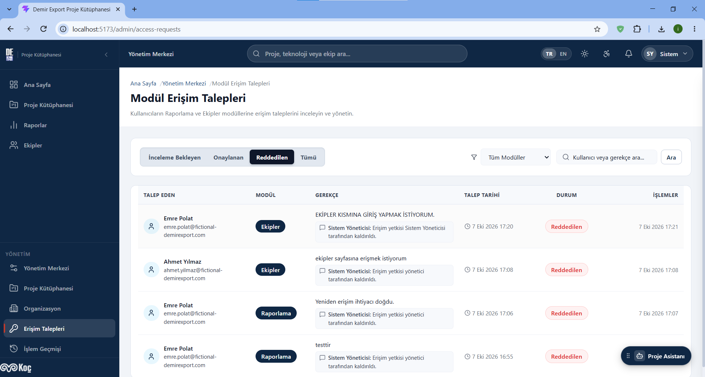
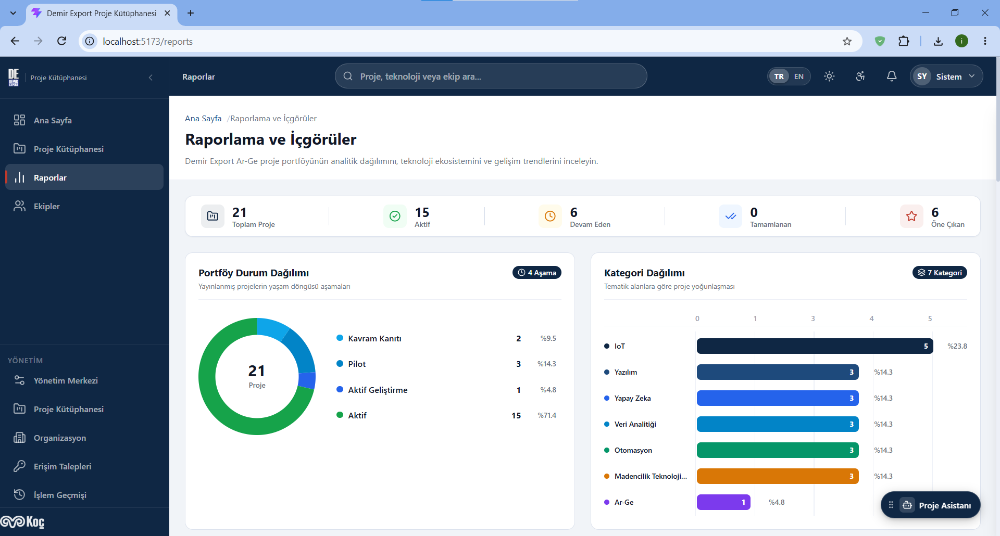
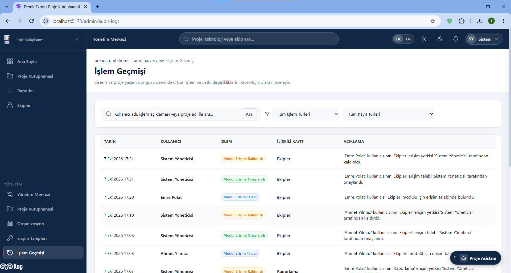
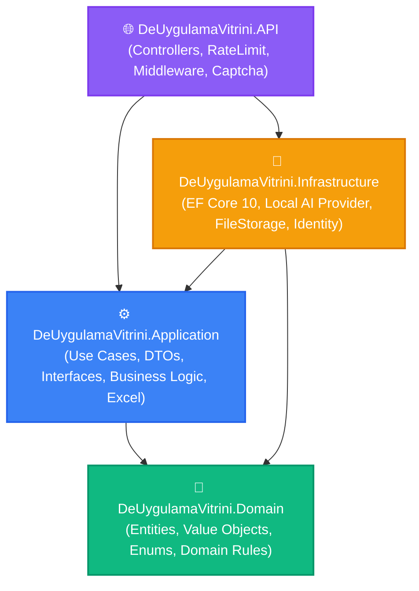
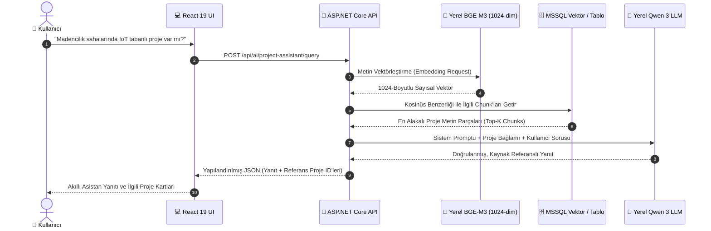
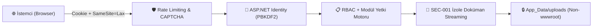

<div align="center">

# 🌟 ProjectAtlas
### Kurumsal Ar-Ge Proje Kütüphanesi & Yerel Yapay Zekâ (RAG) Bilgi Havuzu

<p align="center">
  <strong>Demir Export A.Ş. (Koç Holding) bünyesinde geliştirilmiş kurumsal proje vitrini, semantik RAG asistanı ve güvenli yönetişim platformu.</strong>
</p>

[](LICENSE)
[](https://dotnet.microsoft.com/)
[](https://learn.microsoft.com/dotnet/csharp/)
[](https://react.dev/)
[](https://www.typescriptlang.org/)
[](https://learn.microsoft.com/ef/core/)
[](https://www.microsoft.com/sql-server)
[](https://huggingface.co/BAAI/bge-m3)
[](https://tanstack.com/query/latest)
[](#-güvenlik-ve-yetkilendirme-mimarisi)

<br />

<!-- ========================================== -->
<!-- 🌟 [ANA VİTRİN HERO GÖRSELİ] -->
<!-- Ekran görüntüsünü alıp 'docs/screenshots/01-homepage-showcase.png' olarak kaydedin -->
<!-- ========================================== -->


<br />
<br />

[✨ Neden ProjectAtlas?](#-neden-projectatlas) •
[📸 Görsel Vitrin](#-ekran-görüntüleri-ve-görsel-vitrin) •
[🎯 Öne Çıkan Özellikler](#-öne-çıkan-özellikler) •
[🏛️ Sistem Mimarisi](#-sistem-mimarisi-clean-architecture--ddd) •
[🧠 Yerel RAG & AI Hattı](#-yerel-yapay-zekâ--semantik-rag-hattı) •
[🔒 Güvenlik Mimarisi](#-güvenlik-ve-yetkilendirme-mimarisi) •
[💻 Teknoloji Yığını](#-teknoloji-yığını) •
[🚀 Hızlı Başlangıç](#-hızlı-başlangıç-quick-start) •
[👥 Demo Hesaplar](#-demo-kullanıcı-hesapları--rol-matrisi) •
[🧪 Testler](#-test--regresyon-güvencesi) •
[👨‍💻 Geliştirici](#-geliştirici--teşekkür)

</div>

---

> 📌 **Staj Projesi & Portföy Bildirimi:**  
> Bu proje, **Demir Export A.Ş. (Koç Holding)** Yazılım Mühendisliği Staj Programı kapsamında kurumsal dijitalleşme ve Ar-Ge hafızasını tek merkezde konsolide etmek amacıyla tasarlanıp hayata geçirilmiştir.  
> *Bu açık kaynak portföy sürümünde yer alan tüm projeler, organizasyonel birimler, bütçe verileri, personel bilgileri ve teknik dokümanlar **%100 sentetik (mock / fictional)** verilerden oluşmaktadır. Şirket içi canlı sistemlere, gizli kurumsal verilere veya dış kimlik sağlayıcılarına bağlantı içermez.*

---

## 🌟 Neden ProjectAtlas?

Büyük ölçekli endüstriyel kuruluşlarda (Madencilik, IoT, Ağır Sanayi, Tesis Otomasyonu) geliştirilen yazılım, yapay zekâ, saha teknolojisi ve Ar-Ge projeleri departman silolarında sıkışıp kalmakta; mükerrer yatırımlara ve kurumsal hafıza kaybına yol açmaktadır.

**ProjectAtlas**, kurum genelindeki tüm inovasyon projelerini tek bir merkezde toplayarak:
- **Kurumsal Hafıza:** Proje detaylarını ve teknik şartnameleri merkezi, filtrelenebilir ve versiyonlanan bir yapıda korur.
- **Mükerrer Yatırımları Önleme:** Şirket genelindeki benzer saha çözümlerini teknoloji ve mimari etiketleriyle anında görünür kılar.
- **Yapay Zekâ ile Anında Erişim:** %100 yerel çalışan **BGE-M3 + Qwen 3 RAG** motoruyla yüzlerce sayfalık teknik dokümanları saniyeler içinde doğal dille özetler ve kaynak referanslarıyla yanıtlar.
- **Sıkı Kurumsal Yönetişim:** Modül bazlı onay iş akışları, SEC-001 izole streaming ve tam denetim izi (audit log) sunar.

---

## 📸 Ekran Görüntüleri ve Görsel Vitrin

> 💡 *Aşağıdaki bölümlere tarayıcınızdan alacağınız ekran görüntülerini ilgili dosya adıyla `docs/screenshots/` dizinine eklediğinizde GitHub üzerinde otomatik ve modern çerçeveli olarak görüntülenecektir.*

---

### 🖥️ 1. Ana Sayfa & Proje Keşif Vitrini (Dashboard & Showcase)
> *Modern kart tasarımları, çok boyutlu filtreleme çubuğu, global arama ve istatistik özet şeridi.*

<div align="center">
  <!-- [BURAYA EKLENECEK: docs/screenshots/01-homepage-showcase.png] -->
  <!-- Tarayıcıda http://localhost:5173 ana sayfasının ekran görüntüsünü alıp bu isimle kaydedin -->
  
</div>

<br />

---

### 🧠 2. Proje Detayı & Yerel Yapay Zekâ (RAG) Asistanı
> *Zengin proje teknik içeriği, entegrasyon şemaları ve sağ altta açık olan yerel BGE-M3 + Qwen 3 destekli akıllı asistan sohbet penceresi.*

<div align="center">
  <!-- [BURAYA EKLENECEK: docs/screenshots/02-project-detail-ai.png] -->
  <!-- Bir projenin detay sayfasını açıp sağ alttaki AI Asistan penceresiyle birlikte ekran görüntüsünü alın -->
  
</div>

<br />

---

### ✍️ 3. Zengin Proje Editörü & Doküman Yönetimi
> *Çok sekmeli proje oluşturma/düzenleme formu, teknoloji etiketleri, ekip üyesi bağlama ve SEC-001 güvenli dosya yükleme paneli.*

<div align="center">
  <!-- [BURAYA EKLENECEK: docs/screenshots/03-project-editor.png] -->
  <!-- http://localhost:5173/admin/projects/new veya proje düzenleme ekranının görüntüsünü alın -->
  
</div>

<br />

---

### 🛡️ 4. Modül Erişim Yönetimi & Talep Onay İş Akışı
> *Raporlar ve Ekipler modüllerine özel erişim talep listesi, yönetici onay/ret aksiyonları ve geçmişi koruyan yetki iptal paneli.*

<div align="center">
  <!-- [BURAYA EKLENECEK: docs/screenshots/04-module-access.png] -->
  <!-- http://localhost:5173/admin/module-access ekranının görüntüsünü alın -->
  
</div>

<br />

---

### 📊 5. İnteraktif Raporlama & Analitik Grafikler
> *Departman bazlı bütçe dağılımları, teknoloji trendleri, tamamlanma yüzdeleri ve analitik veri görselleştirmeleri.*

<div align="center">
  <!-- [BURAYA EKLENECEK: docs/screenshots/05-reports-analytics.png] -->
  <!-- http://localhost:5173/reports sayfasındaki grafiklerin görüntüsünü alın -->
  
</div>

<br />

---

### 📜 6. Sistem Denetim İzi & Güvenlik Günlükleri (Audit Logs)
> *Sistem genelindeki tüm proje onayları, yetkilendirmeler ve veri güncellemelerini zaman damgası ve kullanıcı bilgisiyle izleyen denetim tablosu.*

<div align="center">
  <!-- [BURAYA EKLENECEK: docs/screenshots/06-audit-logs.png] -->
  <!-- http://localhost:5173/admin/audit-logs sayfasının görüntüsünü alın -->
  
</div>

<br />

---

## ✨ Öne Çıkan Özellikler

| Modül / Özellik | Simge | Detaylı Açıklama |
| :--- | :---: | :--- |
| **İnteraktif Proje Vitrini** | 🌐 | Departman, geliştirme durumu, teknoloji yığını, hedef saha ve anahtar kelime kombinasyonlarıyla anlık filtreleme ve kart/liste görünümleri. |
| **Yerel AI & Semantik RAG** | 🧠 | Kurum içi verileri dışarı sızdırmayan, **1024-Boyutlu BGE-M3 Vektör Embedding** ve **Qwen 3 LLM** destekli soru-cevap asistanı. |
| **Modül Erişim Yönetimi** | 🛡️ | Raporlar ve Ekipler modüllerine özel talep oluşturma, yönetici onay kuyruğu ve geçmişi koruyan yetki kaldırma (*Historical Revocation*). |
| **SEC-001 Doküman İzolasyonu** | 🔒 | Teknik şartnameleri `wwwroot` dışı güvenli dizinde saklayan, dizin atlatma (Path Traversal) ve IDOR korumalı streaming indirme motoru. |
| **Birinci Taraf SVG CAPTCHA** | 🧩 | Harici servis bağımlılığı olmayan, in-memory ve rate-limit korumalı görsel CAPTCHA katmanı ile kaba kuvvet (brute-force) savunması. |
| **Zengin İstatistik & Raporlama** | 📊 | Departman bazlı bütçe dağılımları, teknoloji trendleri, tamamlanma yüzdeleri ve SVG/Canvas analitik grafikleri. |
| **Excel Wizard (Import/Export)** | 📑 | Toplu proje verilerini şablon ile içeri aktarma, satır bazlı validasyon ve tek tıkla dışa aktarma (export). |
| **Çoklu Dil & Tema Sistemi** | 🌍 | Tam kapsamlı Türkçe / İngilizce (i18n) dil desteği ve dinamik HSL renk değişkenli Açık / Koyu (Dark Mode) temaları. |
| **Tam Denetim İzi (Audit Log)** | 📜 | Sistemdeki tüm onay, güncelleme, erişim ve durum değişikliklerini kullanıcı ve IP damgasıyla kaydeden log motoru. |

---

## 🏛️ Sistem Mimarisi (Clean Architecture & DDD)

Proje, **Clean Architecture**, **Domain-Driven Design (DDD)** ve **CQRS** prensiplerine uygun olarak 4 temel katmanda inşa edilmiştir:

```
ProjectAtlas/
├── backend/
│   ├── src/
│   │   ├── DeUygulamaVitrini.Domain/          # Saf iş kuralları, Varlıklar (Entities), Enum'lar, Değer Nesneleri
│   │   ├── DeUygulamaVitrini.Application/     # Use-Case servisleri, DTO'lar, Arayüzler, Excel Motoru, CQRS
│   │   ├── DeUygulamaVitrini.Infrastructure/  # EF Core 10, SQL Server, Local AI Provider, SEC-001 İzolasyonu
│   │   └── DeUygulamaVitrini.API/             # ASP.NET Core 10 Web API, Middleware'ler, CAPTCHA, Rate Limiter
│   └── tests/
│       ├── DeUygulamaVitrini.SecurityTests/   # SEC-001 Yetkilendirme & IDOR Regresyon Testleri
│       ├── DeUygulamaVitrini.AiTests/         # RAG, Embedding & Warm-Up Entegrasyon Testleri
│       ├── DeUygulamaVitrini.ExcelTests/      # Excel Şablon ve Toplu İçe Aktarım Testleri
│       └── DeUygulamaVitrini.CaptchaTests/    # 1st-Party SVG CAPTCHA Doğrulama Testleri
└── frontend/                                  # React 19 + TypeScript 5 Single Page Application (SPA)
    └── src/
        ├── components/                        # UI Tasarım Sistemi (Cards, Modals, Forms, Charts)
        ├── context/                           # Auth, ModuleAccess, Theme, Accessibility Context'leri
        ├── pages/                             # Sayfa Bileşenleri (Vitrin, Editör, Admin, Raporlar)
        ├── services/                          # Axios API İstemcisi & Tip Tanımlı Servis Katmanı
        ├── styles/                            # Vanilla CSS Tokens, Glassmorphism, Dark/Light Temalar
        └── i18n/                              # Türkçe / İngilizce Çift Dil Sözlüğü
```

### Katman Bağımlılık Şeması



---

## 🧠 Yerel Yapay Zekâ & Semantik RAG Hattı

ProjectAtlas, harici bulut API'lerine şirket verisi sızdırmadan çalışan **%100 yerel yapay zekâ** mimarisine sahiptir:



- **Hibrit Arama (Lexical + Semantic):** Başlık, özet ve teknik etiketler üzerinden hem tam metin (LIKE) hem de vektörel anlamsal (cosine similarity) skorlama.
- **Arkaplan Mutabakat Servisi (`SemanticIndexReconciliationWorker`):** Yeni eklenen veya düzenlenen projelerin vektör embedding'lerini arka planda asenkron senkronize eder.
- **Soğuk Başlangıç Isınma Servisi (`AiWarmupHostedService`):** Sunucu ayağa kalktığında yapay zekâ modelini önceden ısıtarak ilk sorgudaki gecikmeyi (cold-start) ortadan kaldırır.
- **Zarif Geri Çekilme (Graceful Fallback):** Yerel AI sunucusuna erişilemediğinde sistem çökmez; klasik arama moduna kesintisiz devam eder.

---

## 🔒 Güvenlik ve Yetkilendirme Mimarisi

ProjectAtlas, kurumsal güvenlik standartlarına uygun olarak **Savunma Derinliği (Defense-in-Depth)** prensibiyle tasarlanmıştır:



### 1. Kimlik Doğrulama & Oturum Yönetimi
- **ASP.NET Core Identity** altyapısı ile güvenli parola hash'leme (PBKDF2).
- **HTTP-Only, Secure, SameSite=Lax Cookie (`.DemirExport.Auth`)** oturum yönetimi.
- Frontend'e kesinlikle hassas token sızdırılmaz; tüm API istekleri `withCredentials: true` ile taşınır.
- REST API uyumlu `401 Unauthorized` ve `403 Forbidden` JSON hata sözleşmesi.

### 2. Sertleştirilmiş Özel Doküman Güvenliği (SEC-001)
- Projeye eklenen teknik şartname ve mimari raporlar kesinlikle **`wwwroot` dışına (`App_Data/uploads/`)** izole edilmiştir.
- Statik dosya URL'leri üzerinden anonim indirme tamamen engellenmiştir.
- Dokümanlar yalnızca yetkisi doğrulanmış kullanıcılara özel streaming endpoint'i (`GET /api/projects/{id}/documents/{docId}/download`) üzerinden güvenli başlıklarla (`X-Content-Type-Options: nosniff`, `Content-Disposition: attachment`) sunulur.
- **Dizin geçişi (Path Traversal - `../../`)** ve **IDOR** girişimlerine karşı mutlak dosya yolu denetimi uygulanır.

### 3. Birinci Taraf SVG CAPTCHA Savunması
- Üçüncü parti takipçi veya harici servis bağımlılığı olmayan, in-memory ve rate-limit korumalı görsel SVG CAPTCHA katmanı.
- Brute-force oturum açma girişimlerine karşı endpoint seviyesinde koruma sağlar.

---

## 💻 Teknoloji Yığını

| Katman | Teknoloji / Kütüphane | Kullanım Amacı |
| :--- | :--- | :--- |
| **Backend Framework** | ASP.NET Core 10 Web API | Yüksek performanslı RESTful servis mimarisi (C# 13) |
| **ORM & Veritabanı** | EF Core 10 + Microsoft SQL Server 2022 | Split Queries, Global Soft-Delete filtreleri, İndekslemeler |
| **Kimlik & Güvenlik** | ASP.NET Core Identity | Cookie Auth, PBKDF2 Hashing, In-Memory Rate Limiter |
| **Yapay Zekâ / LLM** | BGE-M3 + Qwen 3 (OpenAI Compatible) | 1024-dim yerel vektör embedding ve RAG soru-cevap |
| **Excel Motoru** | ClosedXML / OpenXml | Şablonlu Excel içe/dışa aktarım ve toplu veri işleme |
| **Frontend Framework** | React 19 + TypeScript 5 | Tip güvenli, bileşen tabanlı modern SPA |
| **Build & Tooling** | Vite 8 + Rollup | Milisaniyeler mertebesinde HMR ve optimize üretim derlemesi |
| **Durum Yönetimi** | TanStack Query v5 (React Query) | Sunucu durumu önbellekleme, arkaplan senkronizasyonu |
| **Yönlendirme & İkonlar** | React Router v7 + Lucide React | Güvenli rota koruyucuları (ProtectedRoute), modern SVG ikonlar |
| **Uluslararasılaştırma** | i18next + react-i18next | Tam kapsamlı Türkçe / İngilizce dil desteği |
| **Tasarım & Tema** | Vanilla CSS Tokens | Glassmorphism, HSL renk paletleri, Dinamik Açık/Koyu Tema |

---

## 🚀 Hızlı Başlangıç (Quick Start)

### Ön Gereksinimler
- [.NET 10.0 SDK](https://dotnet.microsoft.com/download/dotnet/10.0)
- [Node.js (v20+)](https://nodejs.org/) & `npm`
- [Docker Desktop](https://www.docker.com/) veya [SQL Server LocalDB](https://learn.microsoft.com/sql/database-engine/configure-windows/sql-server-express-localdb)

---

### Adım 1: Depoyu Klonlayın
```bash
git clone https://github.com/ismaildundar42/project-atlas-internship.git
cd ProjectAtlas-Portfolio
```

---

### Adım 2: Veritabanını Başlatın (Docker)
```bash
# SQL Server 2022 Konteynerini Arka Planda Başlatın
docker-compose up -d
```
*(Alternatif olarak Windows ortamında `(localdb)\mssqllocaldb` doğrudan kullanılabilir; `appsettings.Development.json` varsayılan olarak LocalDB ile uyumludur).*

---

### Adım 3: Backend API'yi Çalıştırın
```bash
cd backend/src/DeUygulamaVitrini.API

# Bağımlılıkları yükleyin ve API'yi başlatın
# (İlk açılışta 20 zengin sentetik proje ve yetki şeması otomatik tohumlanır)
dotnet run
```
- 📍 **API Adresi:** `http://localhost:5000`
- 📖 **Swagger OpenAPI Arayüzü:** `http://localhost:5000/swagger`

---

### Adım 4: Frontend Uygulamasını Çalıştırın
```bash
cd frontend

# Bağımlılıkları yükleyin
npm install

# Geliştirme sunucusunu ayağa kaldırın
npm run dev
```
- 🌐 **Web Arayüzü:** `http://localhost:5173`

---

## 👥 Demo Kullanıcı Hesapları & Rol Matrisi

Geliştirme ortamında test yapabilmeniz için hazır tohumlanmış hesaplar:

| E-posta | Parola | Rol | Yetki Kapsamı |
| :--- | :--- | :--- | :--- |
| `admin@demirexport.com` | `AdminPassword123!` | 👑 **SuperAdmin** | Sistem genelinde tam yetki, proje onay/ret, kullanıcı ve modül erişim yönetimi |
| `creator@demirexport.com` | `CreatorPassword123!` | ✍️ **Proje Girişi** | Yeni proje taslağı oluşturma, kendi projelerini düzenleme ve onaya sunma |
| `user@demirexport.com` | `UserPassword123!` | 🔍 **Standart Kullanıcı** | Yayındaki projeleri inceleme, AI asistanını kullanma, modül erişim talebi iletme |
| `readonly@demirexport.com` | `ReadOnlyPassword123!` | 👁️ **Salt Okunur** | Temel vitrin görüntüleme yetkisi |

> ℹ️ *Giriş ekranında güvenli birinci taraf SVG CAPTCHA doğrulaması aktiftir.*

---

## 🧪 Test & Regresyon Güvencesi

Proje, kritik güvenlik, AI ve iş akışı senaryolarını denetleyen otomatik test paketlerine sahiptir:

```bash
# Tüm Test Paketlerini Çalıştırın
dotnet test backend/DeUygulamaVitrini.sln

# Özellikle SEC-001 Güvenlik ve İzolasyon Testlerini Çalıştırın
dotnet test backend/tests/DeUygulamaVitrini.SecurityTests
```

### Test Kapsamı:
- ✅ **SEC-001 Yetki Denetimi:** Anonim ve yetkisiz kullanıcıların taslak projelere ve dokümanlara erişiminin engellenmesi (`401` / `403`).
- ✅ **Path Traversal Savunması:** `../../` formatındaki dizin atlatma ve dosya sızdırma girişimlerinin tespiti.
- ✅ **IDOR Koruması:** Farklı projelere ait doküman ID'si ile yapılan yetkisiz indirme taleplerinin engellenmesi (`404 NotFound`).
- ✅ **Streaming Başlıkları:** `X-Content-Type-Options: nosniff` ve `Content-Disposition` akış doğrulamaları.
- ✅ **CAPTCHA & Rate Limit:** Oturum açma isteklerinde brute-force saldırı bariyeri kontrolleri.

---

## 👨‍💻 Geliştirici & Teşekkür

<div align="center">

**Geliştirici:** İsmail Dündar  
**Kurum:** Demir Export A.Ş. — Koç Holding  
**Program:** Yazılım Mühendisliği Staj Programı  

<br />

*Demir Export Ar-Ge ve Dijital Dönüşüm ekibine staj sürecindeki destek, vizyon ve rehberlikleri için teşekkür ederim.*

<br />

[](https://github.com/ismaildundar42)
[](https://linkedin.com)

</div>