# Demir Export Project Hub
## Kurumsal Proje Kütüphanesi ve Yapay Zekâ Destekli Bilgi Platformu

### Kullanım Kılavuzu, Sistem Mimarisi, Teknik Referans, AI / RAG Mimarisi, Yönetim ve Bakım Rehberi

---

## İçindekiler Tablosu

- [Bu Doküman Nasıl Okunmalı?](#bu-doküman-nasıl-okunmalı)
- [PART I — Ürün ve Kullanım Kılavuzu](#part-i--ürün-ve-kullanım-kılavuzu)
  - [1. Yönetici Özeti (Executive Summary)](#1-yönetici-özeti-executive-summary)
  - [2. Problem ve Çözüm Yaklaşımı](#2-problem-ve-çözüm-yaklaşımı)
  - [3. Kullanıcı Rolleri ve Yetki Matrisi](#3-kullanıcı-rolleri-ve-yetki-matrisi)
  - [4. Uçtan Uca Kullanıcı Yolculuğu (User Journey)](#4-uçtan-uca-kullanıcı-yolculuğu-user-journey)
  - [5. Modül ve Ekran Kullanım Kılavuzu](#5-modül-ve-ekran-kullanım-kılavuzu)
    - [5.1. Giriş ve CAPTCHA Doğrulama (Login)](#51-giriş-ve-captcha-doğrulama-login)
    - [5.2. Ana Panel (Dashboard)](#52-ana-panel-dashboard)
    - [5.3. Proje Kütüphanesi (Project Library)](#53-proje-kütüphanesi-project-library)
    - [5.4. Proje Detay Sayfası (Project Detail)](#54-proje-detay-sayfası-project-detail)
    - [5.5. Proje Editörü ve İçerik Yönetimi (Project Editor)](#55-proje-editörü-ve-içerik-yönetimi-project-editor)
    - [5.6. Bildirim Merkezi (Notifications)](#56-bildirim-merkezi-notifications)
    - [5.7. Global ve Filtreli Arama (Search)](#57-global-ve-filtreli-arama-search)
    - [5.8. Organizasyon, Departman ve Takım Yönetimi](#58-organizasyon-departman-ve-takım-yönetimi)
    - [5.9. Raporlama ve Analitik Paneli (Reports)](#59-raporlama-ve-analitik-paneli-reports)
    - [5.10. Excel İçe / Dışa Aktarım (Import / Export Wizard)](#510-excel-içe--dışa-aktarım-import--export-wizard)
    - [5.11. Profil ve Erişim Bilgileri](#511-profil-ve-erişim-bilgileri)
- [PART II — Yönetim ve İş Akışları (Administration & Workflow)](#part-ii--yönetim-ve-iş-akışları-administration--workflow)
  - [6. Proje Onay Süreci (Approval Workflow)](#6-proje-onay-süreci-approval-workflow)
  - [7. Organizasyonel Hiyerarşi ve Rol Yönetimi](#7-organizasyonel-hiyerarşi-ve-rol-yönetimi)
  - [8. Sistem Denetim İzi (Audit Log Architecture)](#8-sistem-denetim-izi-audit-log-architecture)
- [PART III — Sistem ve Yazılım Mimarisi](#part-iii--sistem-ve-yazılım-mimarisi)
  - [9. Genel Sistem Mimarisi (Architecture Overview)](#9-genel-sistem-mimarisi-architecture-overview)
  - [10. Frontend Katman Mimarisi](#10-frontend-katman-mimarisi)
  - [11. Backend Katman Mimarisi (.NET 10.0)](#11-backend-katman-mimarisi-net-100)
  - [12. İstek Yaşam Döngüsü (Request Lifecycle)](#12-istek-yaşam-döngüsü-request-lifecycle)
  - [13. Etki Alanı Modeli (Domain Entities & Relationships)](#13-etki-alanı-modeli-domain-entities--relationships)
  - [14. Veritabanı Mimarisi ve Migrasyonlar](#14-veritabanı-mimarisi-ve-migrasyonlar)
  - [15. Kimlik Doğrulama ve Oturum Mimarisi (Authentication)](#15-kimlik-doğrulama-ve-oturum-mimarisi-authentication)
  - [16. Yetkilendirme ve Erişim Kontrolü (Authorization Engine)](#16-yetkilendirme-ve-erişim-kontrolü-authorization-engine)
  - [17. Çoklu Dil Desteği (Localization / i18n)](#17-çoklu-dil-desteği-localization--i18n)
  - [18. Tema, Tasarım Sistemi ve Erişilebilirlik (A11y)](#18-tema-tasarım-sistemi-ve-erişilebilirlik-a11y)
  - [19. Standart Hata Sözleşmesi (RFC 7807 ProblemDetails)](#19-standart-hata-sözleşmesi-rfc-7807-problemdetails)
  - [20. Sistem Sağlığı ve Dayanıklılık (Health & Resilience)](#20-sistem-sağlığı-ve-dayanıklılık-health--resilience)
- [PART IV — Yapay Zekâ ve Semantik RAG Mimarisi](#part-iv--yapay-zekâ-ve-semantik-rag-mimarisi)
  - [21. AI Yetenekleri ve Genel Bakış](#21-ai-yetenekleri-ve-genel-bakış)
  - [22. AI ve Vektör Terminolojisi](#22-ai-ve-vektör-terminolojisi)
  - [23. Sağlayıcı Soyutlama Mimarisi (IAiProvider & IEmbeddingProvider)](#23-sağlayıcı-soyutlama-mimarisi-iaiprovider--iembeddingprovider)
  - [24. Parçalama ve Belge Oluşturma Stratejisi (Chunk Architecture)](#24-parçalama-ve-belge-oluşturma-stratejisi-chunk-architecture)
  - [25. Semantik İndeks Yaşam Döngüsü ve Mutabakat](#25-semantik-indeks-yaşam-döngüsü-ve-mutabakat)
  - [26. Semantik Arama Hattı (Semantic Search Pipeline)](#26-semantik-arama-hattı-semantic-search-pipeline)
  - [27. RAG ve Asistan Yürütme Motoru (Assistant Orchestration)](#27-rag-ve-asistan-yürütme-motoru-assistant-orchestration)
  - [28. Doğrudan Bağlamlı AI Proje Özeti (Direct Grounded Summary)](#28-doğrudan-bağlamlı-ai-proje-özeti-direct-grounded-summary)
  - [29. Soğuk Başlangıç Isınma Katmanı (AI Cold-Start Warm-Up)](#29-soğuk-başlangıç-ısınma-katmanı-ai-cold-start-warm-up)
  - [30. AI Güvenlik Modeli ve Güven Sınırları (Trust Boundary)](#30-ai-güvenlik-modeli-ve-güven-sınırları-trust-boundary)
- [PART V — Test Mimarisi ve Kalite Standartları](#part-v--test-mimarisi-ve-kalite-standartları)
  - [31. Otomasyon Test Mimarisi ve Kapsam](#31-otomasyon-test-mimarisi-ve-kapsam)
  - [32. Otomasyon Test Metrikleri](#32-otomasyon-test-metrikleri)
  - [33. Kalite Kapıları ve Güvenlik Senaryoları](#33-kalite-kapıları-ve-güvenlik-senaryoları)
- [PART VI — Geliştirme, Dağıtım ve Bakım Rehberi](#part-vi--geliştirme-dağıtım-ve-bakım-rehberi)
  - [34. Proje Dizin Yapısı](#34-proje-dizin-yapısı)
  - [35. Yeni Geliştirici Başlangıç Kılavuzu (Developer Onboarding)](#35-yeni-geliştirici-başlangıç-kılavuzu-developer-onboarding)
  - [36. Yerel Çalıştırma Kılavuzu (Development Runbook)](#36-yerel-çalıştırma-kılavuzu-development-runbook)
  - [37. Test Çalıştırma Kılavuzu (Test Runbook)](#37-test-çalıştırma-kılavuzu-test-runbook)
  - [38. Sorun Giderme Rehberi (Troubleshooting)](#38-sorun-giderme-rehberi-troubleshooting)
  - [39. Güvenli Bakım ve İşletim İlkeleri](#39-güvenli-bakım-ve-işletim-ilkeleri)
- [PART VII — Ekler ve Referanslar](#part-vii--ekler-ve-referanslar)
  - [40. Bilinen Kısıtlamalar (Known Limitations)](#40-bilinen-kısıtlamalar-known-limitations)
  - [41. Kapsam Dışı Konular (Out of Scope)](#41-kapsam-dışı-konular-out-of-scope)
  - [42. Mimari Karar Kayıtları (ADR Özeti)](#42-mimari-karar-kayıtları-adr-özeti)
  - [43. Terimler Sözlüğü (Glossary)](#43-terimler-sözlüğü-glossary)
  - [44. Diyagram Dizini](#44-diyagram-dizini)

---

## Bu Doküman Nasıl Okunmalı?

Bu kılavuz, kurumsal organizasyondaki farklı paydaşların ihtiyaçlarına göre modüler olarak yapılandırılmıştır:

- **Üst Yönetim ve İş Birimi Liderleri:** [Bölüm 1](#1-yönetici-özeti-executive-summary), [Bölüm 2](#2-problem-ve-çözüm-yaklaşımı), [Bölüm 6](#6-proje-onay-süreci-approval-workflow) ve [Bölüm 42](#42-mimari-karar-kayıtları-adr-özeti)'yi inceleyerek sistemin kurumsal katma değerini ve yönetim mekanizmalarını anlayabilir.
- **Son Kullanıcılar ve Proje Yöneticileri:** [PART I (Ürün ve Kullanım Kılavuzu)](#part-i--ürün-ve-kullanım-kılavuzu) altındaki ekran akışlarını ve [Bölüm 5.5](#55-proje-editörü-ve-içerik-yönetimi-project-editor)'teki proje oluşturma rehberini takip etmelidir.
- **Sistem Yöneticileri:** [PART II (Yönetim ve İş Akışları)](#part-ii--yönetim-ve-iş-akışları-administration--workflow), [Bölüm 16](#16-yetkilendirme-ve-erişim-kontrolü-authorization-engine) ve [Bölüm 39](#39-güvenli-bakım-ve-işletim-ilkeleri)'u temel almalıdır.
- **Yazılım Geliştiriciler ve Mimarlar:** [PART III](#part-iii--sistem-ve-yazılım-mimarisi), [PART IV](#part-iv--yapay-zekâ-ve-semantik-rag-mimarisi) ve [PART V](#part-v--test-mimarisi-ve-kalite-standartları) bölümlerinde derinlemesine teknik detayları, veri modellerini ve API yaşam döngülerini bulabilirler.
- **DevOps ve Bakım Ekipleri:** [PART VI (Geliştirme, Dağıtım ve Bakım Rehberi)](#part-vi--geliştirme-dağıtım-ve-bakım-rehberi) altındaki kurulum adımlarını, çalıştırma komutlarını ve hata giderme tablolarını kullanmalıdır.

---

# PART I — Ürün ve Kullanım Kılavuzu

## 1. Yönetici Özeti (Executive Summary)

**Demir Export Project Hub**, şirket bünyesinde yürütülen tüm dijitalleşme, Ar-Ge, yazılım, saha otomasyonu ve mühendislik projelerini tek bir kurumsal merkezde toplayan, kurumsal hafızayı güvence altına alan ve yapay zekâ (RAG) teknolojisiyle bilgiye anında erişim sağlayan merkezi bir **Kurumsal Proje Kütüphanesi ve Akıllı Bilgi Platformu**dur.

Proje; saha lokasyonları, farklı mühendislik departmanları, yüklenici firmalar ve iç yazılım ekipleri tarafından geliştirilen çözümlerin görünürlüğünü en üst düzeye çıkarmayı hedefler. Geliştirilen çözümlerin mükerrer yapılmasını engeller, şirket içi teknik yetkinlik envanterini şeffaflaştırır ve karar vericilere stratejik teknoloji yatırımlarında analitik içgörüler sunar.

## 2. Problem ve Çözüm Yaklaşımı

### Kurumsal Problem
- **Dağınık Bilgi Kaynakları:** Şirket genelinde hangi departmanın hangi teknolojiyi kullandığı, hangi saha problemlerinin daha önce çözüldüğü ve benzer projelerin çıktıları Excel tablolarında veya kişisel hafızalarda kaybolmaktadır.
- **Mükerrer Yatırımlar:** Farklı maden sahalarında veya iş birimlerinde benzer operasyonel ihtiyaçlar için mükerrer yazılım/otomasyon geliştirme maliyetleri oluşmaktadır.
- **Saha-Merkez İletişim Kopukluğu:** Saha operatörlerinin geliştirdiği yenilikçi pratikler merkez ekiplerce görülememekte; merkezde geliştirilen dijital ürünlerin saha erişim talimatlarına erişim zorlaşmaktadır.
- **Bilgiye Erişim Süresi:** Yeni bir proje planlanırken geçmiş tecrübelere ve teknik bağımlılıklara ulaşmak günler almaktadır.

### Project Hub Çözümü
- **Merkezi Proje Vitrini:** Tüm projeler; amaç, çözülen problem, sorumlu ekipler, üyeler, kullanılan teknolojiler, saha lokasyonları, entegrasyonlar ve dokümanlarıyla tekilleştirilmiş bir katalogda listelenir.
- **Yönetişim ve Onay Mekanizması:** Taslak olarak hazırlanan projeler yönetici onay sürecinden geçerek kalite standartlarına uygun biçimde yayınlanır.
- **Doğrudan ve Semantik Yapay Zekâ Asistanı:** Doğal dilde sorulan kurumsal sorulara (ör. *"Kangal sahasında IoT tabanlı hangi projelerimiz var?"*), kurumsal veritabanına sıkı sıkıya bağlı (grounded) ve referans göstererek (citation) anında yanıt verir.
- **Gelişmiş Excel Entegrasyonu:** Mevcut kurumsal proje envanterlerinin güvenli, atomik ve onaylı sihirbaz adımlarıyla sisteme aktarılmasını sağlar.

---

## 3. Kullanıcı Rolleri ve Yetki Matrisi

Sistemde yetkilendirme, kullanıcı rolleri (`Role`), kullanıcı bayrakları (`CanCreateProjects`) ve proje sahipliği (`Ownership`) kombinasyonuyla belirlenir.

| Aktör / Rol | Giriş Durumu | Yayınlanan Projeleri İnceleme | Kendi Projesini Oluşturma / Düzenleme | Başkasının Projesini Düzenleme | Onay İnceleme / Red / Onay | Organizasyon & Kullanıcı Yönetimi | AI Asistan & Semantik Arama | Excel Dışa Aktarma | Excel İçe Aktarma (Import) |
| :--- | :--- | :--- | :--- | :--- | :--- | :--- | :--- | :--- | :--- |
| **Anonim (Ziyaretçi)** | Giriş Yapılmamış | Hayır (Login sayfasına yönlendirilir) | Hayır | Hayır | Hayır | Hayır | Hayır | Hayır | Hayır |
| **Normal Kullanıcı** | Aktif Oturum | Evet | Hayır (Yetki yoksa) | Hayır | Hayır | Hayır | Evet (Yalnızca yayınlanmış projeler) | Evet | Hayır |
| **Proje Oluşturucu (`CanCreateProjects=true`)** | Aktif Oturum | Evet | Evet (Taslak/Reddedilmiş durumdayken) | Hayır | Hayır | Hayır | Evet | Evet | Hayır |
| **Yönetici (`Admin`)** | Aktif Oturum | Evet | Evet (Tüm durumlar) | Evet | Evet | Evet | Evet (Taslaklar dahil) | Evet | Evet |
| **Süper Yönetici (`SuperAdmin`)** | Aktif Oturum | Evet | Evet (Tam Erişim) | Evet | Evet | Evet (Kullanıcı Rol Atama) | Evet (Taslaklar dahil) | Evet | Evet |

---

## 4. Uçtan Uca Kullanıcı Yolculuğu (User Journey)

Aşağıdaki akış, kullanıcının sisteme girişinden itibaren gerçekleştirebileceği temel rotaları göstermektedir:

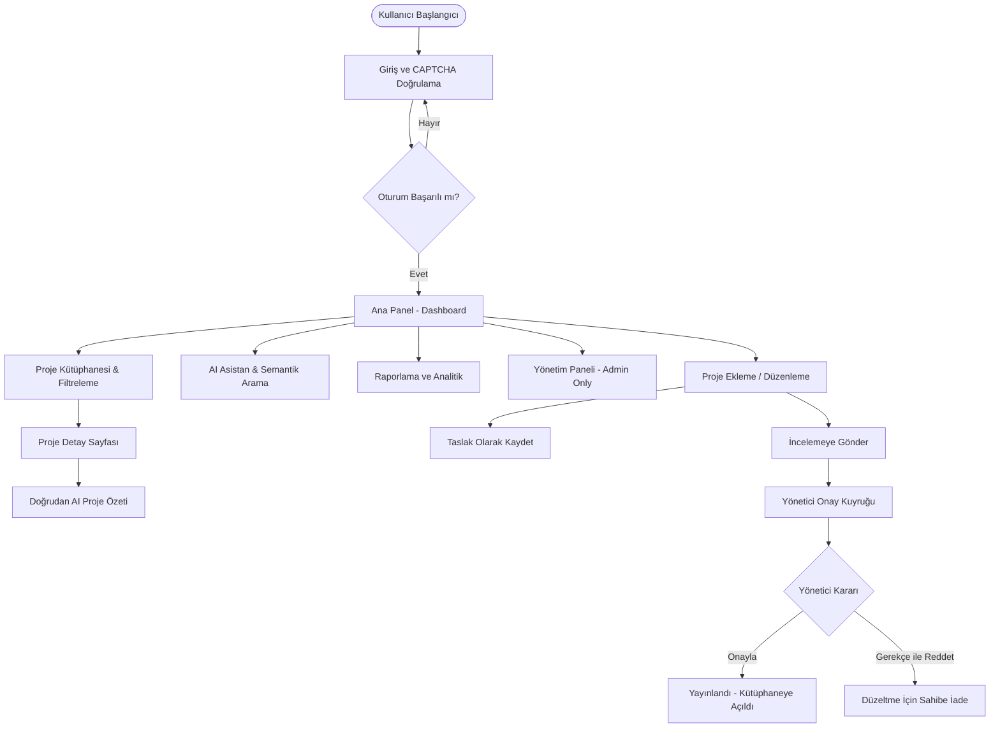

---

## 5. Modül ve Ekran Kullanım Kılavuzu

### 5.1. Giriş ve CAPTCHA Doğrulama (Login)

#### Bu ekran nedir?
Kullanıcıların kurumsal e-posta ve şifreleri ile sisteme kimlik doğrulaması yaptığı güvenli giriş kapısıdır.

> [GÖRSEL ÖNERİSİ]  
> Giriş Ekranı ve Dinamik SVG CAPTCHA Bileşeni

#### Kimler kullanabilir?
Tüm şirket personeli ve sistem yöneticileri.

#### Ne yapılabilir?
- Kurumsal e-posta ve şifre girilir.
- Otomatik üretilen 5 karakterli görsel CAPTCHA kodu girilir.
- CAPTCHA okunamıyorsa yenileme butonuyla anında yeni kod talep edilir.
- Başarılı doğrulamada güvenli HTTP-Only Cookie oturumu oluşturulur ve kullanıcı Dashboard'a yönlendirilir.

#### Teknik Arka Plan
Tarayıcı `/api/auth/captcha` uç noktasına istek atarak benzersiz bir `challengeId` alır ve `/api/auth/captcha/image/{id}` üzerinden saf SVG formatında render edilmiş görseli çeker. Doğrulama başarılı olunca ASP.NET Core Identity oturum çerezi üretir.

---

### 5.2. Ana Panel (Dashboard)

#### Bu ekran nedir?
Kullanıcıyı karşılayan, sistemdeki toplam proje sayılarını, geliştirme durumlarını, öne çıkan projeleri ve hızlı aksiyonları gösteren özet gösterge panelidir.

> [GÖRSEL ÖNERİSİ]  
> Dashboard İstatistik Kartları, Öne Çıkan Projeler ve Kategori Dağılım Grafikleri

#### Kullanıcı ne görür?
- **Metrik Kartları:** Toplam Proje, Yayındaki Projeler, Aktif Geliştirme Sürecindekiler, Tamamlananlar.
- **Öne Çıkan Projeler (Featured Projects):** Şirket için kritik öneme sahip, vitrine çıkarılmış projelerin kartları.
- **Son Eklenenler / Güncellenenler:** Kütüphaneye en son katılan çalışmalar.
- **Hızlı Erişim Butonları:** Proje Ekle, Raporları Gör, AI Asistan'a Sor.

---

### 5.3. Proje Kütüphanesi (Project Library)

#### Bu ekran nedir?
Şirketteki tüm onaylanmış ve yayına alınmış projelerin listelendiği, detaylı filtrelenebildiği ana arama ve keşif alanıdır.

> [GÖRSEL ÖNERİSİ]  
> Proje Kütüphanesi Liste ve Izgara Görünümü, Sol Filtre Paneli

#### Kullanılabilen Filtreler:
- **Metin Arama:** Proje adı, kısa açıklama, amaç ve etiketlerde anlık arama.
- **Durum:** Planlama, Aktif Geliştirme, Canlıda, Tamamlandı, Arşivlendi.
- **Kategori:** Saha Otomasyonu, Web Uygulaması, Veri Analitiği, Mobil, Yapay Zekâ vb.
- **Departman ve Takım:** İlgili projeyi yürüten kurumsal birimler.
- **Saha Lokasyonu:** Kangal, Divriği, Ankara Merkez vb.
- **Geliştirme Tipi:** Şirket İçi (Inhouse), Dış Kaynak (Outsourced), Hibrit.
- **Sıralama:** Yeniden Eskiye, Alfabetik (A-Z), Duruma Göre.

---

### 5.4. Proje Detay Sayfası (Project Detail)

#### Bu ekran nedir?
Bir projenin tüm yönleriyle incelendiği 360 derece kurumsal bilgi sayfasıdır.

> [GÖRSEL ÖNERİSİ]  
> Proje Detay Sayfası: Sekmeli Görünüm, AI Özet Butonu ve Ekip Listesi

#### İçerik Alanları:
1. **Genel Bakış:** Kapak görseli, proje durumu, kategorisi, başlangıç/bitiş tarihleri, tek cümlelik özet.
2. **Amaç ve Problem:** Bu projenin neden yapıldığı, çözdüğü somut iş problemi ve sağladığı iş etkisi/kazancı (ROI).
3. **Kullanıcı Kitlesi ve Erişim:** Saha çalışanları için sade açıklama, hedef kitle tanımları ve canlı uygulama / kaynak kod (repo) bağlantıları.
4. **Teknoloji Yığını:** Projede kullanılan diller, framework'ler, veritabanları ve kütüphaneler.
5. **Organizasyon ve Ekip:** Sorumlu departman, görev alan takımlar, proje yöneticisi ve geliştirici personeller.
6. **Lokasyonlar:** Projenin uygulandığı maden ocakları, tesisler veya ofisler.
7. **Entegrasyonlar:** Projenin veri alışverişinde bulunduğu diğer kurumsal sistemler (SAP, SCADA, IoT Gateway vb.).
8. **Dokümanlar ve Medya:** Kullanım kılavuzları, PDF'ler, mimari çizimler ve ekran görüntüleri.
9. **Yapay Zekâ Proje Özeti:** Tek tıkla çalışan, projenin tüm bağlamını okuyup yönetici özeti çıkaran akıllı modül.

---

### 5.5. Proje Editörü ve İçerik Yönetimi (Project Editor)

#### Bu ekran nedir?
Yeni bir projenin sisteme kaydedildiği veya mevcut projelerin güncellendiği çok sekmeli, doğrulama kurallarına sahip gelişmiş form ekranıdır.

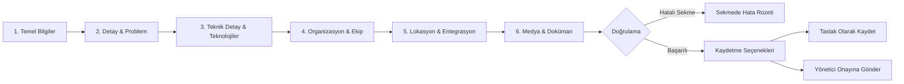

#### Önemli Kurallar:
- **Slug Otomasyonu:** Proje adı yazıldığında URL dostu benzersiz slug (`ornek-proje-adi`) Türkçe karakterler dönüştürülerek otomatik oluşturulur.
- **Sekme Doğrulama Rozetleri:** Zorunlu alanların eksik bırakıldığı sekmelerde anında kırmızı uyarı rozetleri belirir; kullanıcının hatayı aramasına gerek kalmaz.
- **Taslak Modu:** Proje oluşturucu, zorunlu alanların bir kısmını daha sonra tamamlamak üzere projeyi `Draft` olarak kaydedebilir.

---

### 5.6. Bildirim Merkezi (Notifications)

#### Bu ekran ve bileşen nedir?
Kullanıcının projeleriyle ilgili iş akışı durum değişikliklerini, onay/red kararlarını ve sistem duyurularını anlık takip ettiği merkezdir.

#### İş Akışı Bildirimleri:
- *Projeniz İncelemeye Alındı:* Proje sahibine onay sürecinin başladığını bildirir.
- *Projeniz Onaylandı:* Yönetici projeyi onayladığında kütüphanede yayınlandığı müjdesini iletir.
- *Düzeltme Talebi / Red:* Yönetici red gerekçesini ilettiğinde proje sahibine bildirim gider ve düzenleme kilidi açılır.

---

### 5.7. Global ve Filtreli Arama (Search)

Sistemde iki katmanlı arama motoru mevcuttur:
1. **Geleneksel Global Arama (SQL / Full-Text):** Proje adı, kategori, takım adı, etiket ve teknolojilerde tam eşleşme veya alt metin araması yapar. Hızlı ve deterministiktir.
2. **Yapay Zekâ Semantik Arama:** Doğal dilde yazılan kavramsal sorguların anlamına göre arama yapar (Bkz. [Bölüm 26](#26-semantik-arama-hattı-semantic-search-pipeline)).

---

### 5.8. Organizasyon, Departman ve Takım Yönetimi

- **Departmanlar:** Şirket ana organizasyon birimleri (ör. Bilgi Teknolojileri, Maden Operasyonları, İş Sağlığı ve Güvenliği).
- **Takımlar:** Departmanlara bağlı çalışan operasyonel gruplar (ör. Yazılım Geliştirme Takımı, Otomasyon Ekibi).
- **Üyeler (Members):** Takımlara atanan çalışan profilleri, unvanları ve iletişim bilgileri.

---

### 5.9. Raporlama ve Analitik Paneli (Reports)

#### Ölçülen ve Raporlanan Metrikler:
- **Kategori Bazlı Dağılım Grafiği:** Hangi alanda kaç proje üretildiğinin pasta/halka grafiği.
- **Durum Dağılımı:** Canlıda, geliştirmede veya planlamada olan projelerin hacmi.
- **Teknoloji Kullanım Yoğunluğu:** Şirket genelinde en çok tercih edilen ilk 10 teknoloji/kütüphane.
- **Lokasyon Bazlı Proje Yoğunluğu:** Maden sahaları ve işletmeler bazında proje dağılımı.
- **Geliştirme Tipi Oranları:** İç kaynak vs Dış kaynak proje oranları.

---

### 5.10. Excel İçe / Dışa Aktarım (Import / Export Wizard)

#### Dışa Aktarma (Export)
Mevcut proje kütüphanesini tüm ilişkili verileriyle (teknolojiler, takımlar, lokasyonlar) standart `.xlsx` formatında dışa aktarır.

#### İçe Aktarma Sihirbazı (Import Wizard)
Mevcut Excel envanterlerinin hatasız aktarılması için 3 aşamalı kontrollü sihirbaz:
1. **İnceleme (Inspect):** Dosya yüklenir, başlıklar doğrulanır ve ön izleme tablosu oluşturulur.
2. **Doğrulama ve Eşleme (Validate & Map):** Kolonlar veritabanı alanlarıyla eşleştirilir. Sistem lookup değerlerini (durum, kategori, takım vb.) çözer; geçersiz satırları ve eksik alanları raporlar.
3. **Onay ve Atomik Yürütme (Confirm):** Doğrulanan satırlar tek bir veritabanı transaction'ı içerisinde aktarılır. Herhangi bir hata durumunda işlem güvenle geri alınır (rollback).

---

### 5.11. Profil ve Erişim Bilgileri

Kullanıcıların kendi temel hesap bilgilerini, sistem rollerini ve sahip oldukları proje oluşturma yetkilerini görüntülediği alandır. Sistem kimliği (`ApplicationUser`) ile kurumsal organizasyonel çalışan kartı (`Member`) bu ekranda ilişkilendirilebilir.

---

# PART II — Yönetim ve İş Akışları (Administration & Workflow)

## 6. Proje Onay Süreci (Approval Workflow)

Project Hub, veri kalitesini korumak için sıkı bir durum makinesi (State Machine) iş akışına sahiptir:

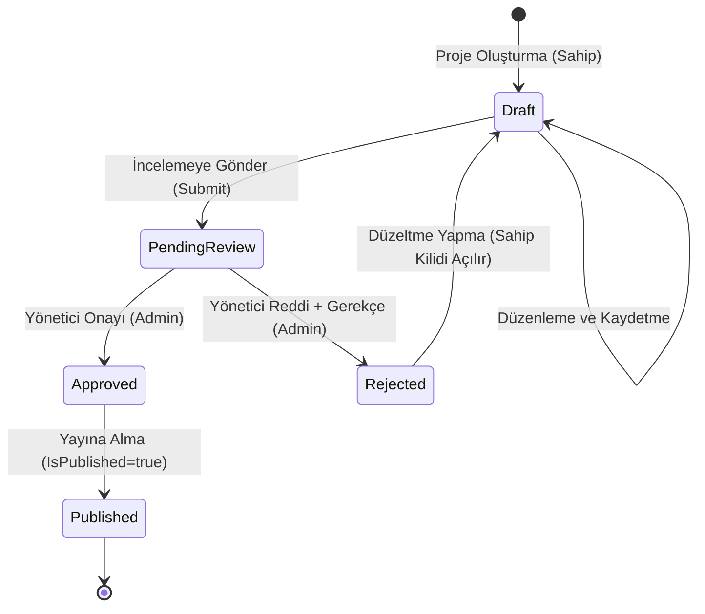

### Durum ve Kilit Kuralları:
- **Taslak (Draft):** Yalnızca oluşturan kullanıcı ve yöneticiler görebilir. Proje sahibi istediği gibi düzenleyebilir.
- **İnceleme Bekliyor (PendingReview):** Proje kilitlenir. Proje sahibi inceleme bitene kadar düzenleme yapamaz. Yöneticilerin onay kuyruğuna düşer.
- **Onaylandı (Approved):** Yönetici projeyi doğrulamıştır. Yayın bayrağı (`IsPublished=true`) açılarak genel kütüphaneye dahil edilir.
- **Reddedildi (Rejected):** Yönetici reddetme gerekçesini sisteme işler. Proje sahibine bildirim gider ve düzenleme kilidi yeniden açılarak düzeltme yapması sağlanır.

> **Önemli Ayrım:** `ProjectApprovalStatus` (Yönetim Onay Durumu: Draft, PendingReview, Approved, Rejected) ile `ProjectStatus` (Mühendislik Yaşam Döngüsü: Planlama, Geliştirme, Canlıda, Arşiv) tamamen bağımsız kavramlardır ve sistemde ayrı yönetilir.

---

## 7. Organizasyonel Hiyerarşi ve Rol Yönetimi

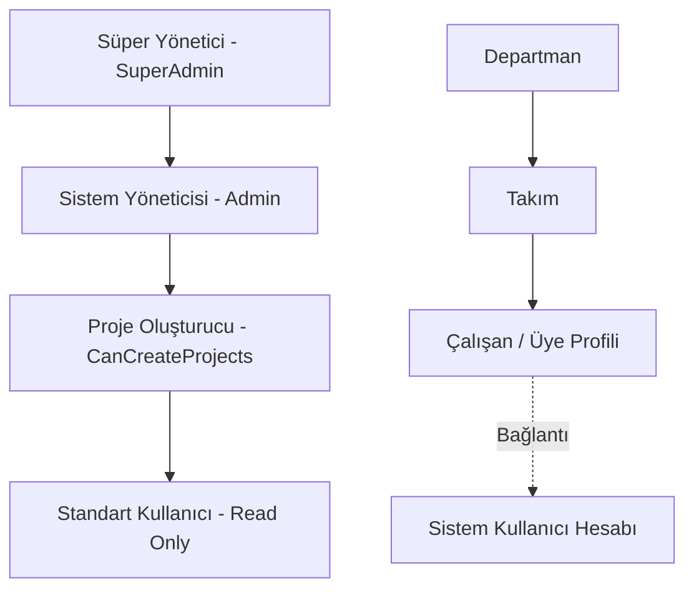

---

## 8. Sistem Denetim İzi (Audit Log Architecture)

Sistemdeki kritik idari eylemler, onaylar, red kararları, kullanıcı rol değişiklikleri ve Excel aktarımları `AuditLog` tablosunda zaman damgası, IP adresi ve işlem detayıyla kaydedilir.

---

# PART III — Sistem ve Yazılım Mimarisi

## 9. Genel Sistem Mimarisi (Architecture Overview)

Project Hub, modern kurumsal yazılım standartlarına uygun olarak katmanlı (Clean Architecture) ve mikroservis-hazır modüler monolit prensipleriyle geliştirilmiştir:

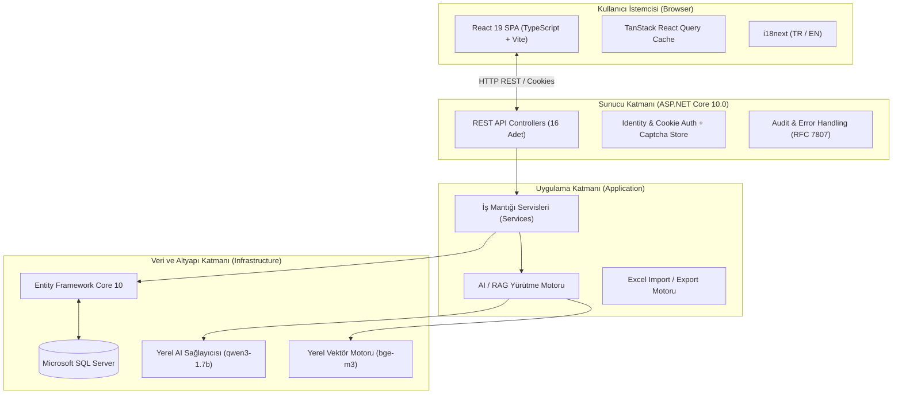

---

## 10. Frontend Katman Mimarisi

Frontend uygulaması **React 19**, **TypeScript** ve **Vite** üzerine inşa edilmiştir.

### Kullanılan Kütüphaneler ve Sürümleri:
- **UI & Runtime:** React `^19.2.8`, ReactDOM `^19.2.8`
- **Routing:** React Router DOM `^7.6.3`
- **Sunucu Durumu Yönetimi:** `@tanstack/react-query` `^5.83.0` (Otomatik önbellekleme, arka plan yenileme)
- **HTTP İstemcisi:** `axios` `^1.9.0` (Global interceptor'lar ile hata ve çerez yönetimi)
- **Çoklu Dil (i18n):** `i18next` `^26.4.2`, `react-i18next` `^17.0.15`
- **İkonografi:** `lucide-react` `^1.47.0`
- **Geliştirme ve Linting:** Vite `^8.3.0`, Oxlint `^1.81.0`, TypeScript `~6.0.2`

---

## 11. Backend Katman Mimarisi (.NET 10.0)

Backend, Microsoft'un en güncel uzun ömürlü framework'ü olan **.NET 10.0** hedefiyle 4 ana projeden oluşmaktadır:

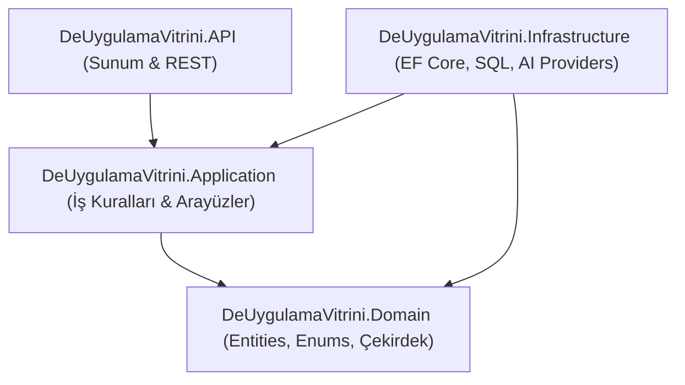

---

## 12. İstek Yaşam Döngüsü (Request Lifecycle)

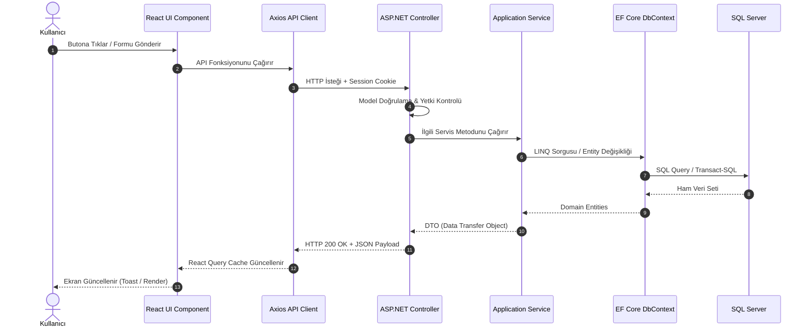

---

## 13. Etki Alanı Modeli (Domain Entities & Relationships)

Sistemde toplam **20 Domain Varlığı** ve **2 Identity Varlığı** bulunmaktadır:

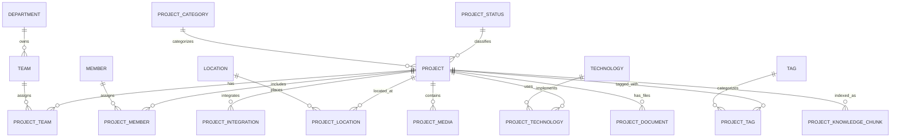

---

## 14. Veritabanı Mimarisi ve Migrasyonlar

Veritabanı erişimi **Entity Framework Core 10.0 Code-First** yaklaşımıyla yürütülmektedir.

### Uygulanan 11 Resmi Migrasyon:
1. `20260922120913_InitialDomainSchema`: Temel proje, kategori, lokasyon, teknoloji ve takım şemaları.
2. `20260924054635_AddProjectDetailEnhancedFields`: Problem, amaç, iş etkisi ve hedef kitle alanları.
3. `20260924060652_AddIdentitySchema`: ASP.NET Core Identity kullanıcı ve rol tabloları.
4. `20260924121608_AddCoverImageUrlToProject`: Proje kapak görseli desteği.
5. `20260925125349_AddProjectUserPermissionsAndRBAC`: Rol tabanlı yetki altyapısı.
6. `20260925141653_SimplifyAuthorizationModel`: Sadeleştirilmiş yetkilendirme modeli.
7. `20260928061037_AddMemberUserIdLink`: Çalışan profili ile kullanıcı hesabı bağlantısı.
8. `20260928082632_AddPhase14ApprovalAndAuditLog`: Onay akışı ve denetim günlüğü tabloları.
9. `20260928105444_AddPhase14WorkflowNotifications`: İş akışı bildirim şeması.
10. `20260929125714_AddPhase18ProjectKnowledgeIndex`: Vektör ve semantik parça indeksi (`ProjectKnowledgeChunks`).
11. `20261001132747_AddMemberTeamRelationship`: Takım ve üye ilişkisi geliştirmeleri.

---

## 15. Kimlik Doğrulama ve Oturum Mimarisi (Authentication)

Sistemde güvenli kurumsal standart olan **ASP.NET Core Identity + HTTP-Only Cookie Authentication** mimarisi kullanılmaktadır.

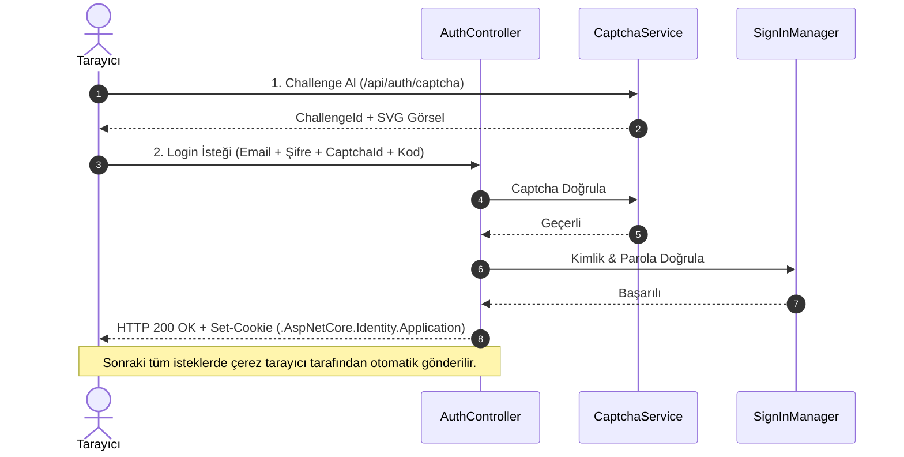

---

## 16. Yetkilendirme ve Erişim Kontrolü (Authorization Engine)

Yetkilendirme kararları `ProjectAuthorizationService` tarafından merkezi olarak işletilir:

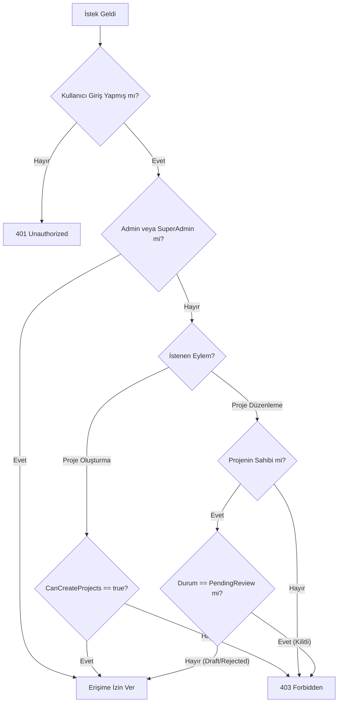

---

## 17. Çoklu Dil Desteği (Localization / i18n)

Arayüz **Türkçe (Varsayılan)** ve **İngilizce** dillerini tam kapsamlı olarak destekler. Toplam 12 modüler isim alanı (namespace) mevcuttur:
`assistant`, `common`, `excel`, `index`, `navigation`, `notifications`, `organization`, `profile`, `projects`, `reports`, `validation`, `workflow`.

---

## 18. Tema, Tasarım Sistemi ve Erişilebilirlik (A11y)

- **Açık / Koyu Tema (Light / Dark Theme):** CSS değişkenleri üzerinden dinamik tema desteği.
- **Erişilebilirlik Standartları:** Modal pencerelerde odak yakalama (focus trap), `Escape` tuşu ile kapatma, form alanlarında `aria-invalid` ve ekran okuyucu uyumlu bildirim yapıları.

---

## 19. Standart Hata Sözleşmesi (RFC 7807 ProblemDetails)

API'den dönen tüm hata yanıtları RFC 7807 uyumlu `ProblemDetails` standardındadır. Frontend `extractErrorMessage` yardımcı fonksiyonuyla bu detayları yakalar ve kullanıcıya anlamlı Türkçe mesajlar gösterir.

---

## 20. Sistem Sağlığı ve Dayanıklılık (Health & Resilience)

`/api/health` uç noktası veritabanı bağlantısını ve yerel AI sağlayıcı erişilebilirliğini kontrol eder. AI servisinin kapalı olması durumunda normal kurumsal proje kütüphanesi işlevlerini kesintisiz sürdürür (Graceful Degradation).

---

# PART IV — Yapay Zekâ ve Semantik RAG Mimarisi

## 21. AI Yetenekleri ve Genel Bakış

Project Hub bünyesinde üç temel yapay zekâ yeteneği barındırır:
1. **Semantik Arama (Semantic Search):** Anlamsal yakınlığa göre proje keşfi.
2. **RAG Asistanı (Project Assistant):** Doğal dil sorularını anlayıp kurumsal veritabanından sentezleyen akıllı asistan.
3. **Doğrudan AI Proje Özeti (Direct Grounded Summary):** Proje detay sayfasında tek tıkla çalışan, bağlamdan sapmayan özetleme motoru.

---

## 22. AI ve Vektör Terminolojisi

- **LLM (Large Language Model):** Metin anlama ve üretme modeli (Yerel `qwen3-1.7b`).
- **Embedding:** Metinlerin 1024 boyutlu matematiksel vektör uzayına dönüştürülmesi (`text-embedding-bge-m3`).
- **Chunk (Parça):** Projenin anlamsal olarak ayrıştırılmış mantıksal metin blokları.
- **RAG (Retrieval-Augmented Generation):** Üretim öncesi veritabanından en alakalı bilgileri çekip modele bağlam olarak sunma mimarisi.
- **Grounding & Citation:** Yanıtların sadece veritabanındaki projelere dayandırılması ve kullanılan projelerin kaynak gösterilmesi.

---

## 23. Sağlayıcı Soyutlama Mimarisi (IAiProvider & IEmbeddingProvider)

Tüm AI operasyonları arayüzler (`IAiProvider`, `IEmbeddingProvider`) üzerinden yürütülür. Sistem hiçbir tescilli bulut sağlayıcısına sıkı sıkıya bağlı değildir; yerel OpenAI uyumlu servisler üzerinden çalışır.

---

## 24. Parçalama ve Belge Oluşturma Stratejisi (Chunk Architecture)

Her proje `ProjectKnowledgeDocumentBuilder` tarafından 3 farklı anlamsal parçaya bölünür:

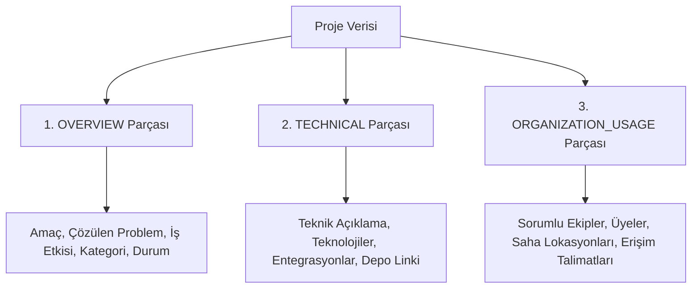

---

## 25. Semantik İndeks Yaşam Döngüsü ve Mutabakat

Projelerdeki değişiklikler SHA-256 içerik karması (`ContentHash`) ile takip edilir:
- **MISSING:** İndeksi hiç olmayan projeler tespit edilip embedding üretilir.
- **STALE:** İçeriği değişmiş projeler güncellenir.
- **CURRENT:** Değişiklik olmayan projeler atlanır (Sıfır ek maliyet).
- **INELIGIBLE:** Silinmiş veya taslak projelerin indeksleri temizlenir.

---

## 26. Semantik Arama Hattı (Semantic Search Pipeline)

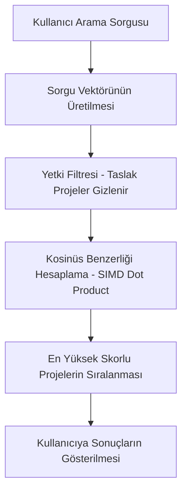

---

## 27. RAG ve Asistan Yürütme Motoru (Assistant Orchestration)

Kullanıcı sorguları `ProjectQueryInterpreter` tarafından analiz edilerek 4 yürütme yolundan en uygununa yönlendirilir:

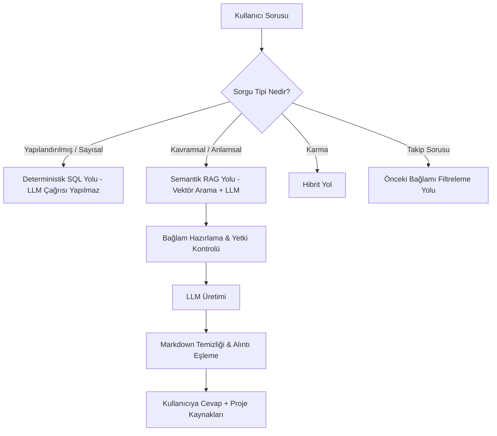

---

## 28. Doğrudan Bağlamlı AI Proje Özeti (Direct Grounded Summary)

Proje detay sayfasındaki özetleme işlemi, RAG arama yükü olmadan doğrudan o projenin veritabanı bağlamını LLM'e sunarak milisaniyeler içinde üretilir. Güvenlik ön filtresi sayesinde yetkisiz kullanıcılar taslak projelerin özetini üretemez.

---

## 29. Soğuk Başlangıç Isınma Katmanı (AI Cold-Start Warm-Up)

Uygulama açılışında arka planda çalışan `AiWarmupBackgroundService`, modelleri belleğe ısıtmak için 8 token'lık nötr bir istek gönderir; böylece ilk kullanıcının istek süresi kısalır.

---

## 30. AI Güvenlik Modeli ve Güven Sınırları (Trust Boundary)

- **SQL Tek Doğruluk Kaynağıdır:** Yapay zekâ hiçbir iş akışını onaylayamaz, değiştiremez veya veritabanını güncelleyemez.
- **Yetki Önceden Denetlenir:** Kullanıcının görme yetkisi olmayan projeler asla LLM bağlamına (prompt context) dahil edilmez.
- **Parola ve Hassas Veri Koruması:** Güvenlik damgaları ve kullanıcı kimlik bilgileri indeksleme motoruna kesinlikle gönderilmez.

---

# PART V — Test Mimarisi ve Kalite Standartları

## 31. Otomasyon Test Mimarisi ve Kapsam

Uygulama, regression ve güvenlik açıklarını önlemek amacıyla geniş kapsamlı bir otomatik test paketiyle korunmaktadır:
- **Birim Testleri (Unit Tests):** Bellek içi dosya yöneticileri, slug algoritmaları, metin temizleyiciler.
- **Entegrasyon Testleri (Integration Tests):** Gerçek HTTP istemcileri ve yetkilendirme akışları.
- **Güvenlik ve Regresyon Testleri:** Rol matrisleri, Captcha kırma koruması, Excel formül enjeksiyonu engelleme.

---

## 32. Otomasyon Test Metrikleri

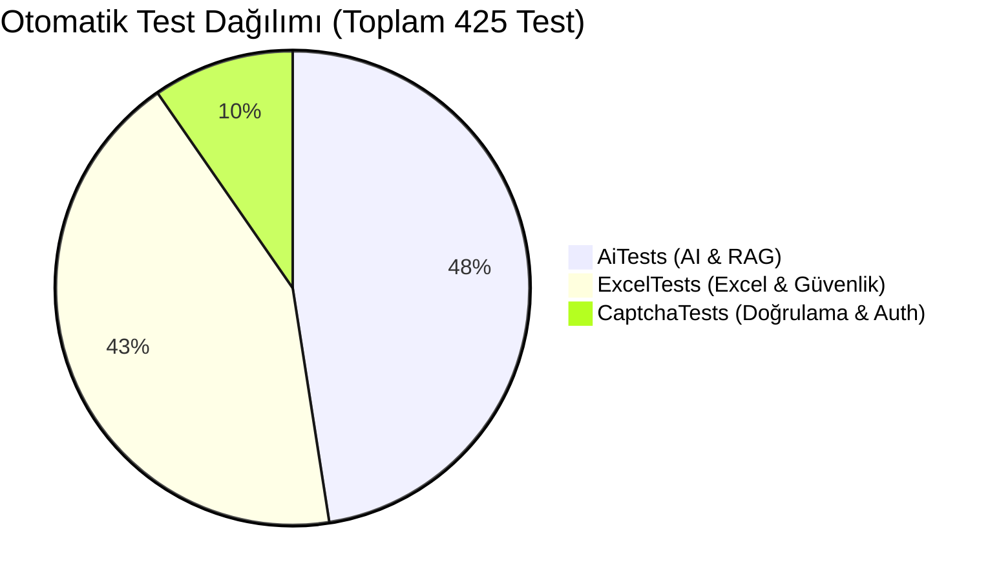

| Test Projesi | Test Sayısı | Başarılı | Başarısız | Atlanan |
| :--- | :---: | :---: | :---: | :---: |
| **DeUygulamaVitrini.AiTests** | 202 | 202 | 0 | 0 |
| **DeUygulamaVitrini.ExcelTests** | 182 | 182 | 0 | 0 |
| **DeUygulamaVitrini.CaptchaTests** | 41 | 41 | 0 | 0 |
| **TOPLAM** | **425** | **425** | **0** | **0** |

---

## 33. Kalite Kapıları ve Güvenlik Senaryoları

- **Senaryo 1:** Yetkisiz kullanıcı taslak projenin ID'sini tahmin etse dahi API ve AI katmanında `403 Forbidden` alır.
- **Senaryo 2:** Excel aktarımında kötü niyetli `=CMD()` formül enjeksiyonları otomatik olarak zararsız metne dönüştürülür.
- **Senaryo 3:** Tek kullanımlık import onay token'ları mükerrer çift tıklamalara karşı atomik olarak korunur.

---

# PART VI — Geliştirme, Dağıtım ve Bakım Rehberi

## 34. Proje Dizin Yapısı

```text
DeUygulamaVitrini/
├── backend/
│   ├── src/
│   │   ├── DeUygulamaVitrini.API/             # REST API Controllers, Middlewares
│   │   ├── DeUygulamaVitrini.Application/     # Servis Arayüzleri, DTO'lar, İş Mantığı
│   │   ├── DeUygulamaVitrini.Domain/          # Varlıklar (Entities), Enum'lar, Sabitler
│   │   └── DeUygulamaVitrini.Infrastructure/  # EF Core, Migrations, AI & Captcha Servisleri
│   └── tests/
│       ├── DeUygulamaVitrini.AiTests/         # AI ve RAG Otomasyon Testleri (202 Test)
│       ├── DeUygulamaVitrini.CaptchaTests/    # Captcha ve Güvenlik Testleri (41 Test)
│       └── DeUygulamaVitrini.ExcelTests/      # Excel ve Entegrasyon Testleri (182 Test)
├── frontend/
│   ├── src/
│   │   ├── api/          # Axios API İstemcileri
│   │   ├── components/   # Yeniden Kullanılabilir UI Bileşenleri (38 Adet)
│   │   ├── pages/        # Sayfa Görünümleri (17 Adet)
│   │   ├── i18n/         # Türkçe ve İngilizce Çeviri Kaynakları (12 Namespace)
│   │   ├── styles/       # CSS Tasarım Sistemi ve Temalar
│   │   └── utils/        # Slug ve Format Yardımcıları
│   └── package.json
└── docs/                 # Proje Dokümantasyonu ve Mimari Raporlar
```

---

## 35. Yeni Geliştirici Başlangıç Kılavuzu (Developer Onboarding)

### Gereksinimler:
- .NET 10.0 SDK
- Node.js (v20+ önerilir)
- Microsoft SQL Server (LocalDB veya SQL Server Express)
- Yerel AI Çalıştırma Ortamı (Opsiyonel — LM Studio vb. OpenAI-uyumlu yerel sunucu)

---

## 36. Yerel Çalıştırma Kılavuzu (Development Runbook)

### 1. Backend Başlatma:
```powershell
cd backend/src/DeUygulamaVitrini.API
dotnet run --launch-profile http
# Backend varsayılan olarak http://localhost:5000 üzerinde dinler.
```

### 2. Frontend Başlatma:
```powershell
cd frontend
npm install
npm run dev
# Frontend varsayılan olarak http://localhost:5173 üzerinde çalışır.
```

---

## 37. Test Çalıştırma Kılavuzu (Test Runbook)

```powershell
# Backend Derleme Kontrolü
dotnet build backend/DeUygulamaVitrini.sln

# Frontend Tip ve Derleme Kontrolü
cd frontend && npm run build && npm run lint

# Otomasyon Test Paketlerini Çalıştırma
dotnet run --project backend/tests/DeUygulamaVitrini.CaptchaTests
dotnet run --project backend/tests/DeUygulamaVitrini.ExcelTests
dotnet run --project backend/tests/DeUygulamaVitrini.AiTests
```

---

## 38. Sorun Giderme Rehberi (Troubleshooting)

| Belirti | Olası Neden | Kontrol ve Çözüm Adımı |
| :--- | :--- | :--- |
| **SQL Bağlantı Hatası (500)** | SQL Server servisi kapalı veya connection string hatalı. | `appsettings.Development.json` içerisindeki `DefaultConnection` bilgisini ve SQL Server servis durumunu kontrol edin. |
| **Giriş Yapılamıyor / 401** | CAPTCHA süresi dolmuş (3 dk) veya hatalı şifre. | CAPTCHA'yı yenileyin, kimlik bilgilerini doğrulayın. |
| **AI Yanıt Vermiyor (503)** | Yerel AI sunucusu (`127.0.0.1:1234`) çalışmıyor. | LM Studio veya yerel sağlayıcının çalıştığını ve modelin yüklendiğini doğrulayın. AI kapalıyken diğer tüm sistem modülleri çalışmaya devam eder. |
| **Vektör Boyut Hatası** | Model değişikliği sonrası embedding boyutu uyuşmuyor. | `appsettings.json` içerisindeki `EmbeddingDimension` değerini güncelleyin ve indeksi yeniden oluşturun. |

---

## 39. Güvenli Bakım ve İşletim İlkeleri

- Canlı veritabanı bağlantı şifrelerini ve gizli anahtarları asla kaynak koda işlemeyiniz.
- Yeni bir etki alanı alanı eklendiğinde sırasıyla Domain -> Infrastructure (Migration) -> Application -> API -> Frontend katmanlarını güncelleyiniz.
- AI indekslerinin daima veritabanından türetildiğini unutmayınız; indeks tablosunu doğrudan elle güncellemek yerine `RebuildIndex` servislerini kullanınız.

---

# PART VII — Ekler ve Referanslar

## 40. Bilinen Kısıtlamalar (Known Limitations)

- **Bildirimler:** Bildirimler anlık WebSocket yerine belirli aralıklarla API sorgulama (polling) yöntemiyle güncellenmektedir.
- **Yerel AI Bağımlılığı:** Geliştirme ortamında AI özellikleri yerel OpenAI uyumlu servislere bağlıdır.

---

## 41. Kapsam Dışı Konular (Out of Scope)

Bu dokümantasyon yalnızca tamamlanmış kurumsal uygulama kapsamını içerir; kurumsal SSO (Single Sign-On) entegrasyonu, yerel mobil uygulama paketleri veya Azure canlı bulut altyapı kurulumları bu fazın kapsamı dışındadır.

---

## 42. Mimari Karar Kayıtları (ADR Özeti)

| Karar | Gerekçe | Etki |
| :--- | :--- | :--- |
| **Cookie Tabanlı Kimlik Doğrulama** | SPA için güvenli HTTP-Only çerez oturumu. | XSS saldırılarına karşı tam koruma, yerel depolamada token saklama riskinin önlenmesi. |
| **Vektörlerin SQL Server'da Saklanması** | Harici vektör veritabanı maliyetini ve yönetim yükünü ortadan kaldırma. | Tekilleştirilmiş yedekleme ve tam ACID transaction güvenliği. |
| **Yerel AI Sağlayıcı Soyutlaması** | Şirket içi veri gizliliği ve bulut bağımsızlığı. | Verilerin şirket sınırları dışına çıkmaması. |

---

## 43. Terimler Sözlüğü (Glossary)

- **Project Hub:** Demir Export kurumsal proje kütüphanesi ve vitrin platformu.
- **Slug:** Projelerin web adreslerinde kullanılan okunabilir tanımlayıcı (ör. `maden-otomasyonu`).
- **Grounding:** Yapay zekâ modelinin uydurma (hallucination) yapmasını önleyerek sadece verilen kurumsal kaynaklara dayanmasını sağlama yöntemi.
- **Citation:** Yapay zekâ cevabında kullanılan projelerin bağlantılı kaynak olarak listelenmesi.

---

## 44. Diyagram Dizini

1. **Uçtan Uca Kullanıcı Yolculuğu** ([Bölüm 4](#4-uçtan-uca-kullanıcı-yolculuğu-user-journey))
2. **Proje Editörü Adımları ve Doğrulama Akışı** ([Bölüm 5.5](#55-proje-editörü-ve-içerik-yönetimi-project-editor))
3. **Proje Onay Durum Makinesi** ([Bölüm 6](#6-proje-onay-süreci-approval-workflow))
4. **Organizasyonel Hiyerarşi ve Rol Yapısı** ([Bölüm 7](#7-organizasyonel-hiyerarşi-ve-rol-yönetimi))
5. **Genel Sistem Mimarisi (Clean Architecture)** ([Bölüm 9](#9-genel-sistem-mimarisi-architecture-overview))
6. **Backend Katman Bağımlılıkları** ([Bölüm 11](#11-backend-katman-mimarisi-net-100))
7. **İstek Yaşam Döngüsü Sekans Diyagramı** ([Bölüm 12](#12-istek-yaşam-döngüsü-request-lifecycle))
8. **Basitleştirilmiş Varlık İlişki Diyagramı (ERD)** ([Bölüm 13](#13-etki-alanı-modeli-domain-entities--relationships))
9. **Kimlik Doğrulama ve Captcha Akışı** ([Bölüm 15](#15-kimlik-doğrulama-ve-oturum-mimarisi-authentication))
10. **Yetkilendirme Karar Ağacı** ([Bölüm 16](#16-yetkilendirme-ve-erişim-kontrolü-authorization-engine))
11. **Anlamsal Parçalama (Chunking) Yapısı** ([Bölüm 24](#24-parçalama-ve-belge-oluşturma-stratejisi-chunk-architecture))
12. **Semantik Arama Hattı** ([Bölüm 26](#26-semantik-arama-hattı-semantic-search-pipeline))
13. **RAG ve Asistan Yürütme Motoru Karar Akışı** ([Bölüm 27](#27-rag-ve-asistan-yürütme-motoru-assistant-orchestration))
14. **Otomatik Test Dağılımı (Pie Chart)** ([Bölüm 32](#32-otomasyon-test-metrikleri))

---
*Dokümantasyon Sürümü: 1.0.0 (Feature Frozen) — Demir Export A.Ş.*
