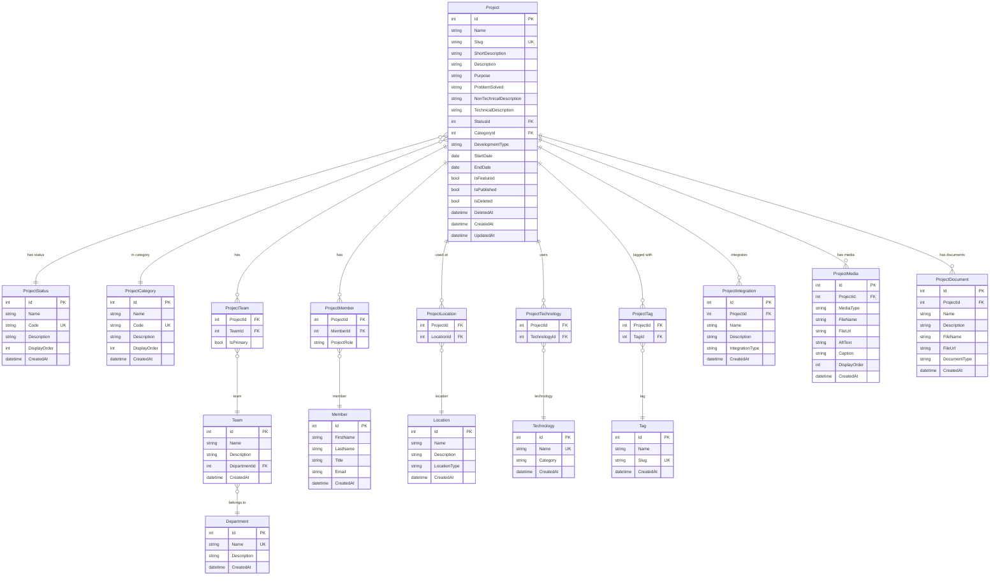

# Database Design — Demir Export Proje Kütüphanesi

> **Belge Türü:** Database Design & Architecture  
> **Versiyon:** 2.0 (Phase 2)  
> **Tarih:** Eylül 2026

---

## 1. Genel Bakış

Sistem **Microsoft SQL Server** ve **EF Core Code First** yaklaşımı ile yönetilmektedir. Domain modeli `Project` ana aggregate'i etrafında şekillenmiştir; reference/master data tablolar, many-to-many join entity'ler ve projeye owned child entity'ler ile desteklenmiştir.

---

## 2. Entity Listesi

| Entity | Tablo Adı | Tür | Açıklama |
|---|---|---|---|
| `Project` | `Projects` | Ana Aggregate | Temel proje kaydı |
| `ProjectStatus` | `ProjectStatuses` | Reference Data | Proje durum listesi |
| `ProjectCategory` | `ProjectCategories` | Reference Data | Proje kategori listesi |
| `Department` | `Departments` | Organizasyonel | Departman |
| `Team` | `Teams` | Organizasyonel | Ekip |
| `Member` | `Members` | Kişi | Proje üyeleri |
| `Location` | `Locations` | Lokasyon | Kullanım yerleri |
| `Technology` | `Technologies` | Teknik | Kullanılan teknolojiler |
| `Tag` | `Tags` | Etiket | Keşif etiketleri |
| `ProjectTeam` | `ProjectTeams` | Join | Proje ↔ Ekip |
| `ProjectMember` | `ProjectMembers` | Join | Proje ↔ Üye |
| `ProjectLocation` | `ProjectLocations` | Join | Proje ↔ Lokasyon |
| `ProjectTechnology` | `ProjectTechnologies` | Join | Proje ↔ Teknoloji |
| `ProjectTag` | `ProjectTags` | Join | Proje ↔ Etiket |
| `ProjectIntegration` | `ProjectIntegrations` | Child | Entegrasyon kayıtları |
| `ProjectMedia` | `ProjectMediaItems` | Child | Medya metadata |
| `ProjectDocument` | `ProjectDocuments` | Child | Doküman metadata |

---

## 3. ER Diyagramı



---

## 4. İlişki Özeti

```
Project
 ├── Status          (many-to-one)   → ProjectStatus
 ├── Category        (many-to-one)   → ProjectCategory
 ├── Teams           (many-to-many)  ↔ Team (via ProjectTeams)
 ├── Members         (many-to-many)  ↔ Member (via ProjectMembers)
 ├── Locations       (many-to-many)  ↔ Location (via ProjectLocations)
 ├── Technologies    (many-to-many)  ↔ Technology (via ProjectTechnologies)
 ├── Tags            (many-to-many)  ↔ Tag (via ProjectTags)
 ├── Integrations    (one-to-many)   → ProjectIntegration
 ├── Media           (one-to-many)   → ProjectMedia
 └── Documents       (one-to-many)   → ProjectDocument

Team
 └── Department      (many-to-one)   → Department
```

---

## 5. Enum Kararları

| Alan | Yaklaşım | Gerekçe |
|---|---|---|
| `DevelopmentType` | **Enum** → `nvarchar(20)` | Kapalı küme; iş mantığı bu değere göre dallanır |
| `LocationType` | **Enum** → `nvarchar(20)` | Kapalı küme; nadiren değişir |
| `TechnologyCategory` | **Enum** → `nvarchar(20)` | Filtreleme için sabit kategori listesi |
| `IntegrationType` | **Enum** → `nvarchar(30)` | Kapalı küme |
| `MediaType` | **Enum** → `nvarchar(10)` | Yalnızca Image/Video |
| `ProjectStatus` | **Tablo** | Kullanıcı arayüzünden yönetilebilir; yeni durum eklenmesi deployment gerektirmemeli |
| `ProjectCategory` | **Tablo** | Kullanıcı arayüzünden yönetilebilir |

**Enum String Dönüşümü:** Tüm enum'lar `HasConversion<string>()` ile database'e okunabilir metin olarak yazılır. Magic integer problemi ortadan kalkar.

---

## 6. Delete Behavior Kararları

| İlişki | Delete Behavior | Gerekçe |
|---|---|---|
| `Project → ProjectStatus` | **Restrict** | Status silinirse projeler korunsun |
| `Project → ProjectCategory` | **Restrict** | Category silinirse projeler korunsun |
| `ProjectTeam ← Project` | **Cascade** | Proje gittiğinde join kaydı silinsin |
| `ProjectTeam ← Team` | **Restrict** | Ekip silinmeden önce bağlantılar temizlenmeli |
| `ProjectMember ← Project` | **Cascade** | Proje gittiğinde join kaydı silinsin |
| `ProjectMember ← Member` | **Restrict** | Üye silinmeden önce bağlantılar temizlenmeli |
| `ProjectLocation ← Project` | **Cascade** | Proje gittiğinde join kaydı silinsin |
| `ProjectLocation ← Location` | **Restrict** | Lokasyon silinmeden önce bağlantılar temizlenmeli |
| `ProjectTechnology ← Project` | **Cascade** | Proje gittiğinde join kaydı silinsin |
| `ProjectTechnology ← Technology` | **Restrict** | Teknoloji silinmeden önce bağlantılar temizlenmeli |
| `ProjectTag ← Project` | **Cascade** | Proje gittiğinde join kaydı silinsin |
| `ProjectTag ← Tag` | **Restrict** | Etiket silinmeden önce bağlantılar temizlenmeli |
| `ProjectIntegration ← Project` | **Cascade** | Entegrasyon projeye özgü; proje gittiğinde anlamsız |
| `ProjectMedia ← Project` | **Cascade** | Medya projeye ait; proje gittiğinde silinsin |
| `ProjectDocument ← Project` | **Cascade** | Doküman projeye ait; proje gittiğinde silinsin |
| `Team → Department` | **Restrict** | Department silinmeden önce ekipler taşınmalı |

---

## 7. Soft Delete Stratejisi

**Kapsam:** Yalnızca `Project` entity'si soft delete kullanır.

**Implementasyon:**
- `SoftDeletableEntity` abstract sınıfı: `IsDeleted`, `DeletedAt`, `DeletedBy`
- `ApplicationDbContext.OnModelCreating`'de EF Core **Global Query Filter**: `p => !p.IsDeleted`
- Child entity'lere matching filter: `pi => !pi.Project.IsDeleted` (Warning 10622 giderildi)
- `IgnoreQueryFilters()` ile admin sorgularında devre dışı bırakılabilir

**Gerekçe:**
- Reference data (Status, Category, Technology vb.) soft delete kullanmaz — bu entity'lerin "pasif" hale getirilmesi ileride ayrı bir `IsActive` flag ile yönetilebilir
- Proje silme işlemi; medya URL'lerini, doküman referanslarını ve audit geçmişini taşıdığından fiziksel silme tercih edilmez

---

## 8. Audit Stratejisi

**Implementasyon:** `AuditableEntityInterceptor` — EF Core `SaveChangesInterceptor`

- `EntityState.Added` → `CreatedAt = DateTime.UtcNow` otomatik set edilir
- `EntityState.Modified` → `UpdatedAt = DateTime.UtcNow` otomatik set edilir; `CreatedAt` korunur
- Uygulama kodu içinde manuel audit alanı set edilmez
- Tüm tarihler **UTC** olarak saklanır

**Gelecek:** `CreatedBy`/`UpdatedBy` alanları authentication eklendikten sonra interceptor içinden `ICurrentUserService` benzeri bir servis aracılığıyla doldurulacaktır.

---

## 9. Index Stratejisi

| Tablo | Kolon | Tür | Amaç |
|---|---|---|---|
| `Projects` | `Slug` | Unique | URL routing |
| `Projects` | `Name` | Normal | Arama |
| `Projects` | `StatusId` | Normal | Filtreleme |
| `Projects` | `CategoryId` | Normal | Filtreleme |
| `Projects` | `IsPublished` | Normal | Liste sorguları |
| `Projects` | `IsDeleted` | Normal | Soft delete filter |
| `ProjectStatuses` | `Code` | Unique | Programatik erişim |
| `ProjectCategories` | `Code` | Unique | Programatik erişim |
| `Tags` | `Slug` | Unique | URL-dostu arama |
| `Technologies` | `Name` | Unique | Tekrarlı kayıt önleme |
| `Departments` | `Name` | Unique | Tekrarlı kayıt önleme |
| `Members` | `Email` | Normal | Arama/lookup |

---

## 10. Seed Stratejisi

**Kapsam:** Yalnızca referans/master data seed edilmiştir.

**Yöntem:** EF Core `HasData()` — migration'a dahil edilir, veritabanı oluşturulduğunda otomatik uygulanır.

**Seed Edilen Tablolar:**

### ProjectStatus (8 kayıt)
| Id | Code | Name |
|---|---|---|
| 1 | `PLANNING` | Planlama |
| 2 | `PROOF_OF_CONCEPT` | Kavram Kanıtı |
| 3 | `PILOT` | Pilot |
| 4 | `ACTIVE_DEVELOPMENT` | Aktif Geliştirme |
| 5 | `ACTIVE` | Aktif |
| 6 | `ON_HOLD` | Beklemede |
| 7 | `COMPLETED` | Tamamlandı |
| 8 | `ARCHIVED` | Arşivlendi |

### ProjectCategory (8 kayıt)
| Id | Code | Name |
|---|---|---|
| 1 | `SOFTWARE` | Yazılım |
| 2 | `ARTIFICIAL_INTELLIGENCE` | Yapay Zeka |
| 3 | `DATA_ANALYTICS` | Veri Analitiği |
| 4 | `IOT` | IoT |
| 5 | `AUTOMATION` | Otomasyon |
| 6 | `MINING_TECHNOLOGY` | Madencilik Teknolojileri |
| 7 | `RD` | Ar-Ge |
| 8 | `OTHER` | Diğer |

**ID Kararlılığı:** Seed ID'leri sabit tutulmuştur; migration'lar arası ID değişimi olmaz.  
**CreatedAt:** Seed kayıtları için sabit `2026-01-01 UTC` değeri kullanılmıştır (interceptor seed sırasında çalışmaz).

---

## 11. Member ↔ User Ayrımı

`Member` entity'si kasıtlı olarak authentication `User`'ından ayrı tutulmuştur.

**Mevcut durum:** Member = proje ekibinde gösterilecek kişi profili  
**Gelecek:** Authentication eklendiğinde `Member.UserId (nullable FK)` ile User kaydına bağlantı kurulacaktır.

Bu ayrım sayesinde:
- Authentication olmadan proje ekip listeleri oluşturulabilir
- Authentication eklendiğinde mevcut Member kayıtları korunur
- Aynı kişi hem Member (proje profili) hem User (sistem erişimi) olabilir

---

## 12. Binary Dosya Saklama Politikası

`ProjectMedia` ve `ProjectDocument` tablolarında yalnızca **metadata ve URL/path** saklanır.

Binary dosyalar SQL Server içinde SAKLANMAZ. Gerçek dosya depolama çözümü ileriki phase'te belirlenecektir:
- Azure Blob Storage (bulut ortamı için)
- Yerel dosya sistemi (on-premise için)
- Network Share

`FileUrl` alanı maksimum 2048 karakter ile sınırlandırılmıştır (URL standartları uyumluluğu).
